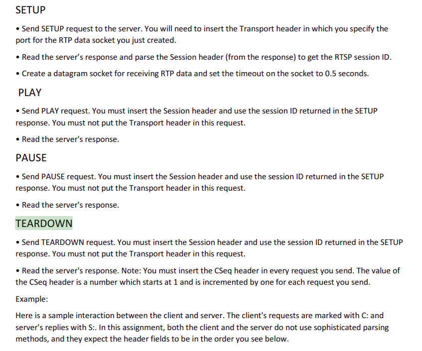

# Elevator

```bash
pip install -r requirements.txt
pip install poetry
```
./bash.sh {M: number of cabins} {N: number of floor}
-> check range:

**User:**
GET: ?/outside/{floor_number}/{direction}
floor_number: in range [1,n]
direction: 0 if moveup and 1 if move down

Constraint: n > 1, m > 0 -> Check invalid 

-> check range

GET: ?/inside/{cabin_id}/{floor_number}
floor_number: in range [1,n]
cabin_id in range [1,m]

Floor 1: Cannot move down
Floor n: Cannot move up

-> check range  
??? When elevator: 

**FloorQueue:** Hashmap 2*M (M floor)
-    Emtpy: -> GET: ?/queue/{floor_number}/{direction}  -> Time
-   Not empty: There are people -> Track the first one (The priority of time)
    -> Elevator comes, all the passenger in the queue go up -> Clean queue. 


**Elevator:**  (Server)
state: Freeze, MoveUp, MoveDown.
current_floor = ? 
journey: start and destination floor. Cannot

- In journey, Have a request in the road -> Stop at that.
is_move = True + False (MOveUp or MoveDown) -> not metion

queue_request: from user + from coordinator 

Pending time:
Come to the floor/ Open door: waiting 4s  (for someone late)

- Done -> Do the first request in queue.

After 20s do have any request -> Go back to Floor 1

1 Floor: 8s.

When Freeze, waiting for the new request (check liên tục hay 1s/1 lần)


**Coordinator:** Middleware
+) Receive the request 
queue_floor_queue = [] 
queue_elevator = []

The first take the front ele take the floor_queue

```bash
Call request from terminal: curl -X 'GET' \
  'http://127.0.0.1:8000/models/alexnet' \
  -H 'accept: application/json'

  uvicorn api:app --reload
```

```bash
curl -X 'POST' 'http://127.0.0.1:8000/inside/0'

```

Bỏ qua opacity
The reason choose GET request instead of POST request: POST to access and changing something such as we want to update, add, del. GET just want to access and respone the data to view it and not change any thing. We try to write to the database. 


  


Use Background task run after return a response. w

When state of elevator is freeze -> it open its door

```bash
cd test
coverage run -m unittest test
coverage report -m
coverage html
```
tuanqm.duckdns.org