# Backend thinking - Part 1 
## Table of Contents
1. [Assignment 1](#assignment-1)
    - [Know your mission](#know-your-mission)
    - [Know your environment](#know-your-environment)
    - [Know your tools](#know-your-tools)
        - [Basic command](#basic-command)
        - [Finding command](#finding-command)
        - [Interacting with file command](#interacting-with-file-command)
        - [Changing information command](#changing-information-command)
        - [Controlling permission command](#controlling-permission-command)
        - [File compression command](#file-compression-command)
        - [Disk storage management command](#disk-storage-management-command)
        - [System adminstrator statistic command](#system-adminstrator-statistic-command)
        - [Connecting to a Remote Server command](#connecting-to-a-remote-server-command)
    - [Handy tools](#handy-tools)
    - [Git](#git)

2. [Assignment 2](#assignment-2)
3. [Assignment 3](#assignment-3)
4. [Assignment 4](#assignment-4)
5. [Assignment 5](#assignment-5)
## Assignment 1
> Try to answer the questions throughout this module (including next week's), note down your takeaway into your submission. We will learn from each other's notes.


### Know your mission
<details>
<summary>Click to toggle contents of submission <b>Know your submission</b></summary>


#### What is backend programming?
Coding behind the front-end, deal and solve the complex algorithm and operation behind such as interact with Database, concern about the performance, delay,... At all, Backend Programming makes the Front-end task more easier.
#### What are the differences backend and frontend programming?
Front end development is programming which focuses on the visual elements (UI) of a website or app that a user will interact with (the client side) and optimize the user expirence (UX). Meanwhile, back end development focuses on the side of a website users can't see (the server side).
#### What do you need to be a backend engineer?
A backend engineer is responsible for designing, building, and maintaining the server-side of web applications. So we need to know the basic things such as Coding (Object-oriented, Functional programming), Back-end programming language (PHP, Python, Java,..), write documentation, testing, problem-solving, design system and know about front-end.

#### Can we deliver our products without a backend?
Yes. But it just work on the small-scale project, handle with small transaction per second, task may load too slow and not restricted in some feature.

#### What is backendless? 
Backendless is an application development platform which has been designed to serve individual developers as well as software agencies. This can provide end to end solutions which are designed for mobile or web development. Some key feature that Backendless app support including Database (Sql, Nosql,...), Cloud Code, Caching, Geolocation, Codeless, Security, Real-time data,...
</details>
<!-- Know your environment -->

### Know your environment
<details>
<summary>Click to toggle contents of submission <b>Know your environment</b></summary>

#### Linux vs Unix? Is Linux a Unix?
Key difference between **Linux** and **Unix**:
+ About source code, **Linux** source code is avaiable to general *public* whereas **Unix** soruce code is *proprietary*.
+ About the first release, **Linux** is an operating system built by Linus Torvalds at the University of Helsinki in 1991 while **UNIX OS** was created in the late 1960s at AT&T Bell Labs. 
+ About the default shell, **Linux** shell is *BASH* while **UNIX** shell is *Bourne Shell*.
+ About the version, **Linux** have some crucial versions including Redhat, **Ubuntu**, OpenSuse,... while that of **Unix** are HP-UX, AIS, BSD,...
+ About the security, **Linux** threat detection and solution are very fast while **Unix** users require longer wait times to get the proper bug fixing patch.

Linux is a **clone** of Unix or we can say Linux is actually a UNIX variant based somewhat on Minix, which is a UNIX variant. So **Linux is a Unix**.
#### Is Ubuntu a Linux? How about CentOS? What are Linux distros?
As we mention before, `Ubuntu` is a Linux distribution based on **Debian** and composed mostly of free and open-source software. **So Ubuntu is a Linux**.

`CentOS`, from Community Enterprise Operating System also known as CentOS Linux is a **Linux distribution** that provides a free and open-source community-supported computing platform, functionally compatible with its upstream source and **Red Hat Enterprise Linux** (RHEL). So, CentOS is a version of Linux, **CentOS is a Linux**.

`Linux Distro` stands for **Linux distribution**. It is an OS made from a software collection that includes the **Linux Kernel** and often package management system. Due to Linux kernel is open-source, this allows developers can reuse and choose some feature and develop new Linux Distro. Thus, there are many Linux Distro created base on inheriting some other Linux Distro with new feature and new name. Linux users usually obtain their operating system by downloading one of the *Linux distributions*. Some popular Linux distro such as Red Hat Enterprise Linux (RHEL), CentOS, Debian, Ubuntu, Fedora, Arch,...

#### Is macOS a Linux distro?
No. `MacOS` is a somewhat distant derivative of BSD, a version of Unix developed at UC Berkeley. MacOS is officially still considered a version of Unix (unlike Linux, which is merely Unix-like), though home users rarely encounter it in that capacity. About **Linux**, it's not a OS at all, it's a **kernel** - the part of an OS that handles directly controlling the hardware in response to requests by the applications, or other parts of the OS. In conclusion, *MacOS* doesn't contain the *Linux kernel*, so **it isn't a Linux Distro**.

#### What is Linux file system? Everything is a file? What is file descriptor?
#### 1. Linux file system
A `Linux file system` is a structured collection of files on a disk drive or a partition. A partition is a segment of memory and contains some specific data. In our machine, there can be various partitions of the memory. Generally, every partition contains a file system.

The Linux file system contains the following sections:
+ The root directory (/)
+ A specific data storage format (EXT3, EXT4, BTRFS, XFS and so on)
+ A partition or logical volume having a particular file system.

About the functionality, `Linux file system`, is generally a built-in layer of a Linux operating system, used to handle the data management of the storage. It helps to arrange the file on the disk storage. It manages the file name, file size, creation date, and much more information about a file.

About the feature, `file system` creates a **tree structure**. All the files are arranged as a tree and its branches. The topmost directory called the root (/) directory. All other directories in Linux can be accessed from the root directory.
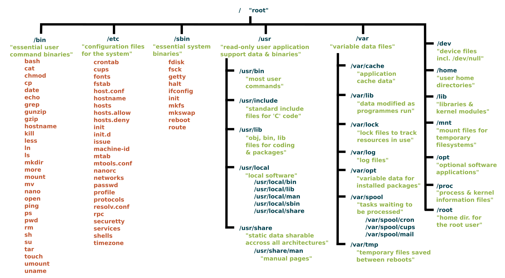  

About the type, initially, when we install the Linux OS, Linux offers many file systems such as **Ext, Ext2, Ext3, Ext4, JFS, ReiserFS, XFS, btrfs, and swap**.
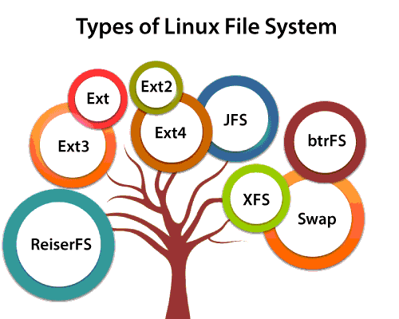  

#### 2. Everything is a file
<!-- "On a UNIX system, everything is a file; if something is not a file, it is a process." -->
**“In Linux, everything is a File”**
This statement is true because there are special files that are more than just files (named pipes and sockets, for instance), but to keep things simple, saying that everything is a file is an acceptable generalization. A Linux system, just like UNIX, makes no difference between a file and a directory, since a directory is just a file containing names of other files. Programs, services, texts, images, and so forth, are all files. Input and output devices, and generally all devices, are considered to be files, according to the system.
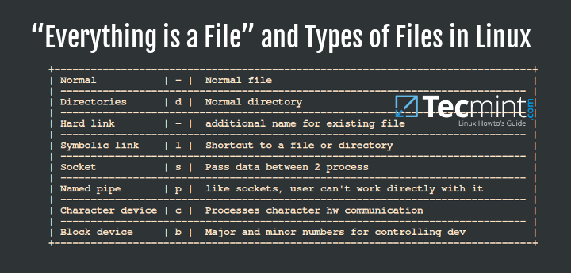  

#### 3. File descriptor
In Unix and Unix-like computer operator system, a `File descriptors` (File handles) is a unique identifier for a file or other input/output resource such as pipe or netwoek socket. **File descriptors** typically have non-negative integer values (eg: 0,1, 345,...), with negative values being reserved to indicate "no value" or error conditions. File descriptor describes a resoruces data and how to access it.

When we open a file, OS will create a identifier for that file and store data in file. So if we open 100 files in OS, we have 100 identifier in **global file table**. This id is non-negeative integer called **File descriptor**.

Each unix process should have 3 standard POSIX file descriptors, corresponding to the three standard streams:
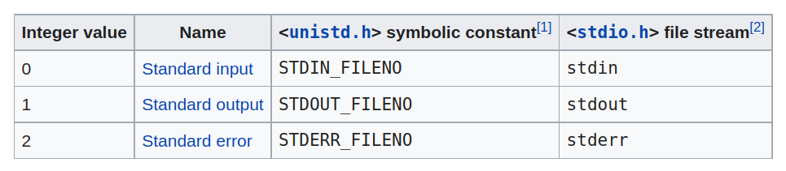  

#### How does Linux file permission work?
**Ownership and Permissions**: To protect and secure files and directory in Linux we use permissions to control what a user can do with a file or directory. Linux uses **three** types of permissions:  `Read`(r), `Write`(w) and `Execute`(x)

**3 classes of user:** 
+ **User:** These type of file permission affect the owner of the file.
+ **Group:** These type of file permission affect the group which owns the file. Instead of the group permissions, the user permissions will apply if the owner user is in this group.
+ **Other:** These type of file permission affect all other users on the system.

Note: To view the permissions we use:  
```bash
ls -l
```
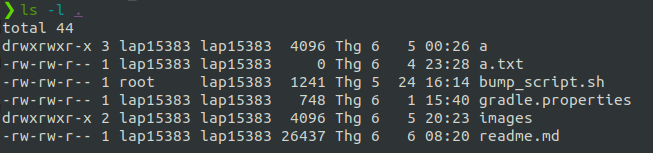  
The permission includes 10 fields:
+ The first one indicates a file if `-`, a directory if `d`, a link if `l`
+ 3 group of 3 symbols if the group of permission for 3 type of class: owner, group and other. With 3 symbols for 3 type of permission: read, write and execute.

Apart from it, we have some command to change the permission such as `chmod`, `chgrp`, `chown`,...
#### Blocking vs Non-blocking I/O?
Blocking and Non-blocking in programming describe a way how to run a program. With Blocking, this means second instruction should be run after the first instruction (run sequential). When the first complete then the second can run. The problems happend when the first operation needs to much time for processing maybe IO (Input/Output) or Network, this will be a obstacle called blocker for the next operator. Otherwise, in Non-block model, the late instruction can be run before the early instruction. This will not sequential and not synchronous and will not depend on the result of the earlier operator.

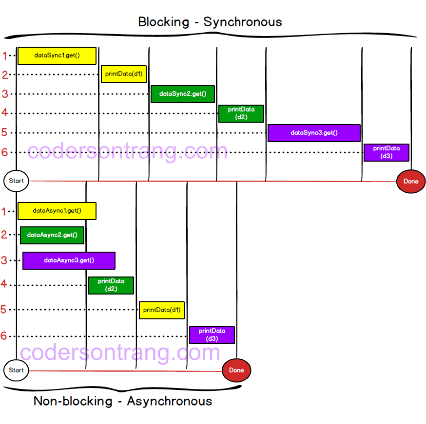  
As we can see in the image above, dataSync2.get() and dataSync3.get() can run independently without any result from data1. In blocking model, we need to run sequentially instruction by instruction to the end and waste too much time and not optimize. In the non-blocking model, we can take full advantages about the independent data to make it Asynchronous.
#### Process vs Thread?
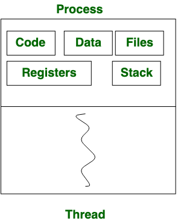  
#### 1. Process
Processes are basically the programs that are dispatched from the ready state and are scheduled in the CPU for execution. PCB(Process Control Block) holds the concept of process. A process can create other processes which are known as Child Processes. The process takes more time to terminate and it is isolated means it does not share the memory with any other process. 
The process can have the following **states**: New, Ready, Running, Waiting, Terminated. 
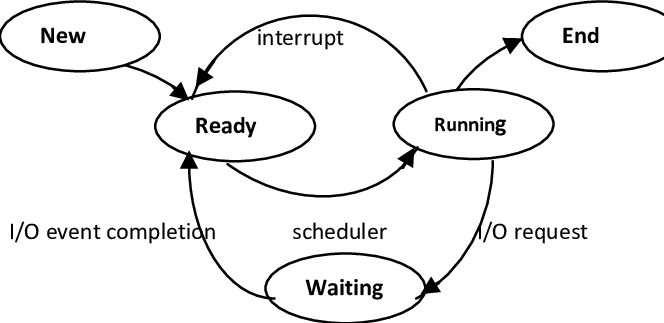  
#### 2. Thread
Thread is the segment of a process means a process can have multiple threads and these multiple threads are contained within a process. A thread has three **states**: Running, Ready, and Blocked. The thread takes *less time* to terminate as compared to the process but unlike the process, threads *do not isolate*. 
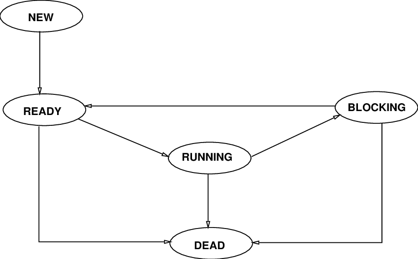  
#### Multi-threading
In computer architecture, `multithreading` is the ability of a central processing unit (CPU) (or a single core in a multi-core processor) to provide multiple threads of execution concurrently, supported by the operating system. This approach differs from multiprocessing. In a multithreaded application, the threads **share the resources** of a single or multiple cores, which include the computing units, the CPU caches, and the translation lookaside buffer (TLB).
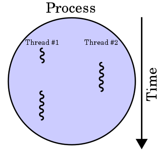  
#### 1. Advantages
If a thread gets a lot of **cache misses**, the other threads can continue taking advantage of the unused computing resources, which may lead to faster overall execution, as these resources would have been idle if only a single thread were executed. Also, if a thread cannot use all the computing resources of the CPU (because instructions depend on each other's result), running another thread may prevent those resources from becoming idle.
#### 2. Disadvantages
Multiple threads can interfere with each other when sharing hardware resources such as caches or translation lookaside buffers (TLBs). As a result, execution times of a single thread are not improved and can be degraded, even when only one thread is executing, due to lower frequencies or additional pipeline stages that are necessary to accommodate thread-switching hardware.
#### Parallel vs Concurent vs Asynchronous
**Concurrency** is when the execution of multiple tasks is interleaved, instead of each task being executed sequentially one after another. This means in a interval, with a thread we can do multiple task by do task 1 a little bit then context switch to task 2 and do little bit and switch to task 1, so on. 
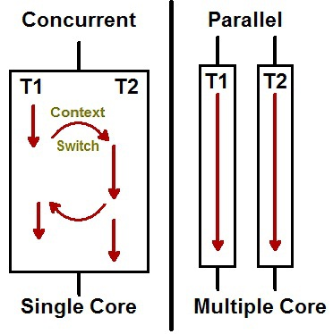  
**Parallelism** is when these tasks are actually being executed in parallel in many core.
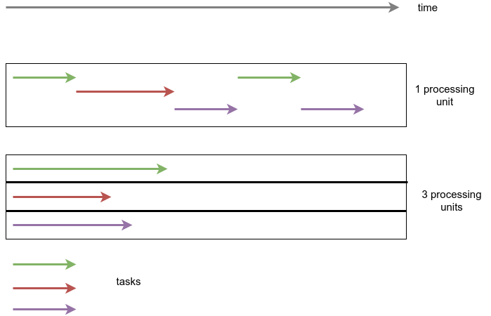  
**Asynchronous** methods is used to present the impression of concurrent or parallel tasking but effectively an asynchronous method call is normally used for a process that needs to do work away from the current application and we don't want to wait and block our application awaiting the response.
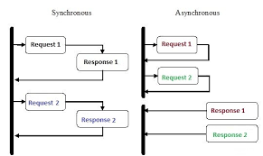
In the image above, we can see that, in Synchronous model, we need to resonpse the first request before receive new request. This is waste time and not optimal. While the Asynchronous model, can receive Request 1 and Request 2 after return the respones due to the independent of data between Resquest 2 and Respone 1. 
#### Race condition, deadlock
#### 1. Race condition
`Race Condition` occurs when two threads hold locks on different resources, each waiting indefinitely for the other to release its lock.
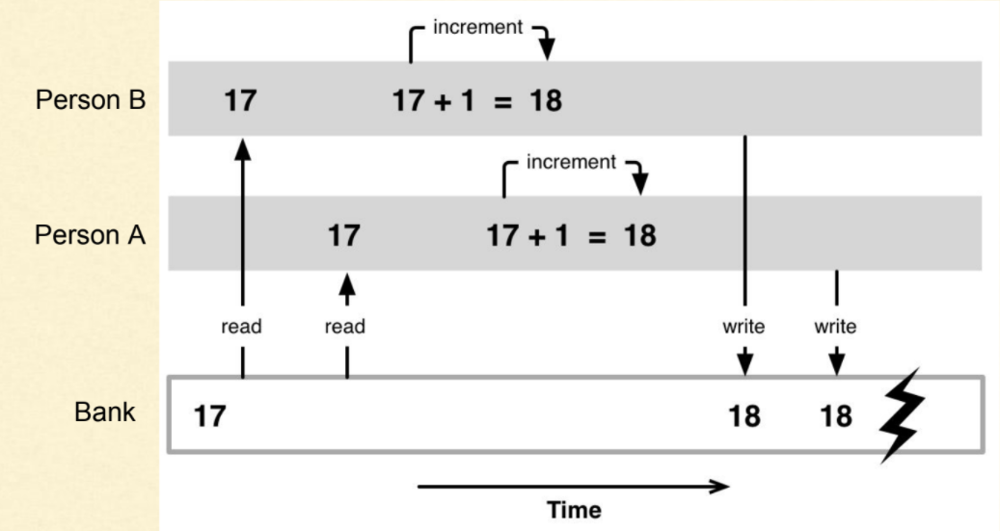  
For example, the person A and B want to add 1\$ to the same account in the bank which is now have 17\$. To complete this task, at first, the person need to read the current value in the bank and increse it to 1 and write to current value. With this process, the expect value is 19\$ = 17\$ + 1\$ + 1\$. But now the person A and B do this task at the same time, B read the value that not update from A yet and B and A write on current value just 18\$. Then we lost 1\$ and this will extremely dangerous in the real-life cases.

#### 2. Deadlock
When two processes are waiting for each other directly or indirectly, it is called `deadlock`. This usually occurs when two processes are waiting for shared resources acquired by others. For example, If thread T1 acquired resource R1 and it also needs resource R2 for it to accomplish its task. But the resource R2 is acquired by thread T2 which is waiting for resource R1(which is acquired by T1).. Neither of them will be able to accomplish its task, as they keep waiting for the other resources they need.
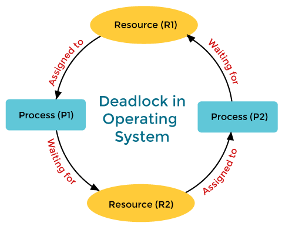  
#### Context switching
In computing, a `context switch` is the process of storing the state of a process or thread, so that it can be restored and resume execution at a later point. This allows multiple processes to share a single central processing unit (CPU), and is an essential feature of a multitasking operating system.

There are three potential triggers for a context switch:
+ Multitasking
+ Interrupt handling
+ User and kernel mode switching

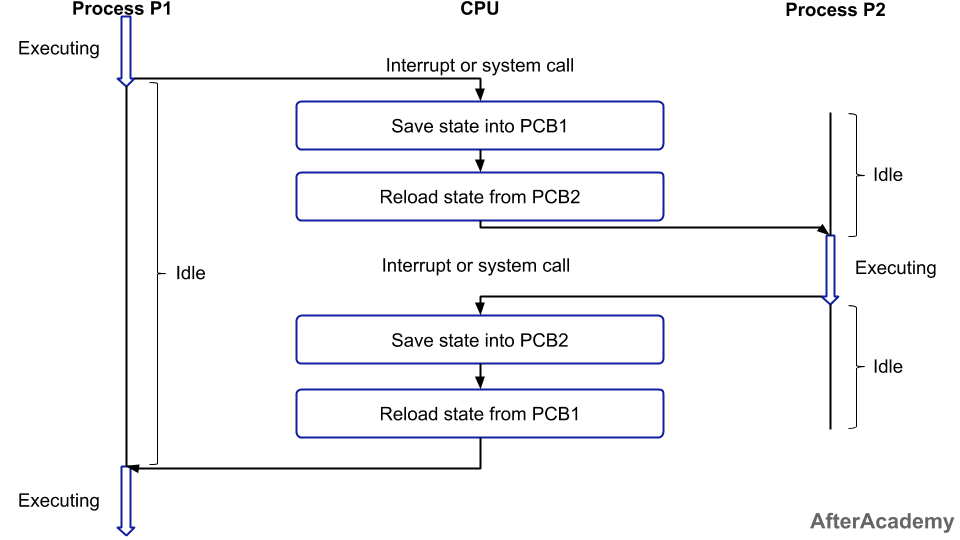  


#### Memory layout: stack, heap
The **memory layout** of a process in Linux can be very complicated if we can present and describe everything in a nutshell like this:
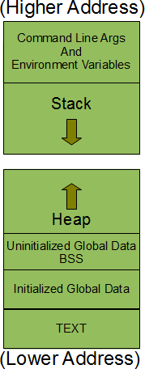  
We just need fully concentrate to stack and heap segment
+ **stack segment** is the memory area which is used by the process to store the *local* variables of function and other information that is saved every time a function is called. This other information includes the return address ie the address from where the function was called, some information on the callers environment like its machine registers etc are stored on stack.
+ **Heap segment** is the one which is used for *dynamic* memory allocation. This segment is **not limited** to a single process, instead it is *shared* among all the processes running in the system. Any process could dynamically allocate memory from this segment.

**Note:** As the figure above, the stack grows *downwards* while the heap grows *upwards*.

#### The shell
Shell is an interactive user interface with an operating system and can be considered an outer layer of the operating system.
#### 1. Bash vs Zsh vs Terminal vs 
`Bash` is the abbreviation of the **Bourne-again shell**. In 1971, the UNIX operating system was released along with the *Thompson shell*. In 1979, the Thompson shell was modified and released as a *Bourne shell*. Brian Fox released Bash in 1989 for his project that provided improvements from its previous versions. Bash release enhanced its use as a scripting language. 

`Zsh` is called **Z Shell**, which is an extension of Bash that has many new features and themes. Zsh was released in 1990 by Paul Falstad. Zsh has similarities with Korn shell as well. Linux and Mac OS use Bash as their default shell. The default Zsh is different from Bash.

`Terminal` is a program that provides a graphical interface between the **shell** and the **user** (not processing the command like shell). It receives from the shell e.g. the characters "command not found" and figures out how to display them to you - with what font, where on the screen, in what colour, whether there should be a scrollbar. When you press some keys, it figures out whether to send them on to the shell as characters (e.g. **ls -l**), or to interpret them on its own.

#### 2. Login shell vs Interactive shell
`A login shell` is a shell where you login. We can recognize a login shell from a `ps -f` command if it exists.
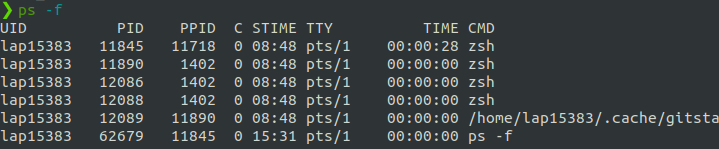  

`An interactive shell` is one which reads commands from and write result to it's standard-input and output. It is usually a terminal. We can go to this shell by enter `bash` command.
#### 3. Variables
The name of a `variable` can contain only letters (a to z or A to Z), numbers (0 to 9) or the underscore character (_). For example, aBc\_, 12aNc but ^!12 is not a variable's name since invalid characters. By convention, Unix shell variables will have their names in **`UPPERCASE`**.
**Some operations**
1. Defining variables
```bash
variable_name=variable_value
# Example:
NAME="Zara Ali"
# Set NAME assign the value "Zara Ali"
```
2. Accessing values
```bash
echo $variable_name # Add prefix its name with the dollar sign
# Example:
echo $NAME
# Print value "Zara Ali"
```
3. Read-only Variables
```bash
readonly variable_name
# Example
NAME="Zara Ali"
readonly NAME
NAME="Qadiri" # Cannot update b/c this variable is read only.
```

4. Unsetting Variables
```bash
unset variable_name
# Example:
echo $NAME # "Zara Ali"
unset NAME
echo $NAME # 
# Print nothing due to $NAME is unset now.
```
</details>
<!-- Know your tools -->

### Know your tools
#### Basic command
<details> 
<summary>Click to toggle contents of submission <b>Basic command</b></summary>

#### 1. echo
This command will display a line of text. 
**Syntax:**
```bash
echo [option] [string]
```
**Example:** 
```bash
echo "Hello Word" # Print Hello World
echo Hello World # Print Hello World
```
**Option**
1. `-e`: Enables the interpretation of backslash escapes (such as \b, \n,..)
```bash
echo "Hello \b Word \t 1234 \n Quach Minh Tuan" 
# Hello Word 	 1234 
#  Quach Minh Tuan
```
2. `echo *`: will print all files, same with `ls` command
3. `-n`: will print trailing newline
```bash
echo -n "Hello Word"  # Print Hello World without newline
```
#### 2. cat
`cat` is the acronym of **concatenate**. It will read data from the file and gives their content as output. It frequently uses for view file    
This command will display a line of text. 
**Syntax:**
```bash
cat [filename]
```
**Option:**
1. View multiple files 
```bash
cat [filename1] [filename2] # It will show the content of file1 and file2
```
2. View files preceding with line numbers
```bash
cat -n [filename]
# 1 This is QMT
# 2 Hello World
```
3. Create a file and edit in it
```bash
cat > newfile
```
4. Copy the contents of one file to another file.
```bash
cat [start-file] > [destination-file]
```
5. Append the contents of start-file to **the end** of destination-file
```bash
cat [start-file] >> [destination-file]
```
6. Suppress repeated empty lines
```bash
cat -s [filename]
# If the file is:
# asdfasdf


# asdf
# Output: 
# asdfasdf

# asdf
```
#### 3. ls
`ls` command uses for list the directory contents.
**Syntax**
```bash
ls [option] [file]
```
**Option**
1. List the hidden files with `ls -a` command.
2. List file in long format with `ls -l`
+ content permissions
+ number of links to the content
+ owner of the content
+ group owner of the content
+ size of the content in bytes
+ last modified date / time of the content
+ file or directory name

3. We can combine 2 options above by using `ls -la` command.
#### 4. cd 
Using `cd` command for changing the *current working directory* in linux or other Unix-like OS. 
**Syntax**
```bash
cd [Option] directory
```
**Example**
```bash
cd Hello World
# Go to the Hello World directory
```
#### 5. pwd
The command `pwd` (stand for **print working directory**) prints the *current working directory* path starting from root (/). This is useful when we get stuck in the Linux file system structure maze.
**Syntax**
```bash
pwd [Option]
```
**Example**
```bash
pwd
# Print /home/lap15383
# The current working directory is /home/lap15383
```
</details>

#### Finding command
<details>
<summary>Click to toggle contents of submission <b>Finding command</b></summary>


#### 1. which
`which` command can find the full path of the **command**, executables.
**Syntax**
```bash
which [option] [command1] [command2] [...]
```
**Example**
```bash
which python abc java
# /home/lap15383/anaconda3/bin/python
# abc not found
# /usr/bin/java
# Explain: the python and java command full link path is existed and is shown on the terminal while abc command is not found
```
**Option**
Option `-a` can print all matching pathnames of each argument.
```bash
which -a touch
# /usr/bin/touch
# /bin/touch
# Explain: this will show 2 full path of touch command. This case happens when 2 versions of the same command installed in different locations or totally different commands using the same name.
```
#### 2. whereis
`whereis` command uses for searching the *binary, source and manual files* for the command specified as an argument. By default, it searches for the command's files in the *hard-coded paths* and directories listed in the *environment variables*. 
**Syntax**
```bash
whereis [option] [filename1] [filename2] [...]
```
**Example**
```bash
whereis bash
# bash: /usr/bin/bash /etc/bash.bashrc /usr/share/man/man1/bash.1.gz
# Explain: 'bash' is the command for which you want to get information, '/bin/bash' and '/etc/bash.bashrc' is the path to the binary file, there is no source file, and '/usr/share/man/man1/bash.1.gz' is the man page. To be more clearly, let's go the option.
```
**Option**
Option `-b`, `-s`, `-m` corresponding search only for the *binary, source and manual files* for the command specified as an argument.
```bash
whereis -b bash
# bash: /usr/bin/bash /etc/bash.bashrc
whereis -s bash
# bash: 
whereis -m bash
# bash: /usr/share/man/man1/bash.1.gz
```
#### 3. locate
The `locate` command finds files in Linux using the file name. `locate` is used for obtaining instantaneous results, and it is an essential utility when speed is a priority. But this command is not already installed in Ubuntu so we need to install manually.
**Installation**
```bash
sudo apt update
sudo apt install mlocate
```
**Syntax**
```bash
locate [options] [pattern]
```
**Example**
```bash
locate bump_script.sh
# /home/lap15383/Backend_1/bump_script.sh
# All locations that filename is 'bump_script.sh' include /home/lap15383/Backend_1/bump_script.sh.
```
#### 4. find
`find` command in UNIX use for finding file and directories and perrform subsequent operations on them.
**Syntax**
```bash
find [options] [path...] [expression]
```
+ The `options` attribute controls the treatment of the symbolic links, debugging options, and optimization method.
+ The `path..`. attribute defines the starting directory or directories where find will search the files.
+ The `expression` attribute is made up of options, search patterns, and actions separated by operators.

**Examples**
1. Find file by names
```bash
find . -name bump_script.sh
# Search for files by name in current working directory
```
2. Find file by extension
```bash
find . -name *.md
# Search for files by extension (ending regex '.md') in current working directory
```
</details>

#### Interacting with file command
<details> 
<summary>Click to toggle contents of submission <b>Interacting with file command</b></summary>

<!-- Interact with file: Create + Move + Copy -->
#### 1. mkdir
`mkdir` command in Linux/Unix allows users to create new directory. It stands for *make directory*
**Syntax**
```bash
mkdir [option] dir_name
```
**Options**
1. Create multiple directories at the same time.
```bash
mkdir {dir1,dir2,dir3} #No space inside the curly brackets
```
2. Make parent directories by using options `-p`. Sometimes, we want to create a structure with multiple *subdirectories* such as we not only want to create a folder name *a*, but also a structure, *a/b/c*
```bash
mkdir -p a/b/c
```
We can check it by using `tree` command.
3. Set permission when making a directory. By default, mkdir just give *rwx* permissions for the current user only for reading, writing, executing. Now we can control it by using `-m` options adding with permissions we want.
```bash
mkdir -m777 abc
# All users (current user, group users, other users) can access with read, write, execute permissions.
```
#### 2. cp
`cp` stands for *copy*. This command is used to copy files or group of file or directory. `cp` command require at least 2 filenames in its arguments.
**Syntax**
1. Copy two file names
If the command contains two file names, then it copy the contents of *1st file* to the *2nd file*. If the *2nd file* doesn’t exist, then first it *creates* one and content is *copied* to it. But if it existed then it is simply *overwritten* without any warning.
```bash
cp src_file dest_file
```
2. Copy multiple files into a directory
This command copies each source file to the destination directory with the same name, created if not existed but if already existed then it will be overwritten.
```bash
cp src_file1 src_file2 src_file3 Dest_directory
# The result after this command, we will create a new Dest_dir if not exist and copy or create new file or overwrite src_file1, src_file2, src_file3 in Dest_dir.
```
3. Copy directory to directory using options `-R`
```bash
cp -R Src_directory Dest_directory
```
#### 3. mv
`mv` stands for *move*. `mv` command is used to move one or more files or directories from one place to another in a file system.
**Syntax**
```bash
mv [option] source destination
```
If the destination file doesn’t exist, it will be created. In the above command mv simply replaces the source filename in the directory with the destination filename(new name). If the destination file exist, then it will be overwrite and the source file will be deleted. By default, mv doesn’t prompt for overwriting the existing file.
**Example**
```bash
cat a.txt
# India

cat b.txt
# geeksforgeeks

mv a.txt b.txt

cat b.txt
# India

# Explain: Now the file a.txt will lost and replace by b.txt. But b.txt is already existed so it overwrites.
```
#### 4. touch
The `touch` command is a standard command used in UNIX/Linux operating system which is used to create, change and modify timestamps of a file. It similars to `cat` command but it will create file with content while `touch` command create file without any content (empty)
**Syntax**
```bash
touch filename1 filename2 filename3 ...
# Result: Create empty file with filename: filename1, filename2, filename3.
```
**Options**
`-a` is used to change or update the last access or modification times of a file.
```bash
touch -a filename
```
#### 5. rm
`rm` stands for remove here. `rm` command is used to remove objects such as files, directories, symbolic links and so on from the file system. *By default, it does not remove directories.*
**Syntax**
```bash
rm [OPTION] FILE
```
**Options**
1. `-r` (Recursion Deletion) is used to delete directory. It performs a tree-walk and will delete all the files and sub-directories recursively of the parent directory.
```bash
rm -r DIR_NAME
```
2. `-f` (Force Deletion): rm prompts for confirmation removal if a file is write protected.
```bash
rm -f FILE
```


<!-- Create SymLinks  -->
#### 6. ln
`ln` is a command-line utility for creating links between files. By default, the ln command creates hard links. To create a symbolic link, use the -s (--symbolic) option.
```bash
ln -s [OPTIONS] FILE LINK
```
+ If both the *FILE* and *LINK* are given, `ln` will create a link from the file specified as the first argument (FILE) to the file specified as the second argument (LINK).
+ If only **one** file is given as an argument or the second argument is a dot (.), ln will create a link to that file in the **current working directory** . The name of the symlink will be the same as the name of the file it points to.
**Usage**
1. Creating Symlink To a File
```bash
ln -s source_file symbolic_link
# Example
ln -s my_file.txt my_link.txt
# Create a link my_link.txt points to my_file.txt
```
To verify that the symlink was successfully created, use the `ls -l` command:
```bash
ls -l my_link.txt
```
2. Creating Symlinks To a Directory
```bash
ln -s source_dir symbolic_dir
# Example
ln -s dir_a dir_b
# Create a link dir_b points to dir_a
```
3. Overwriting Symlinks by using `-f` (--force) option.
```bash
ln -sf my_file.txt my_link.txt
```
4. Remove a symlink
```bash
unlink symlink_to_remove
```
</details>

<!-- Changing information command    -->
#### Changing information command
<details> 
<summary>Click to toggle contents of submission <b>Changing information command</b></summary>

#### 1. chsh
`chsh` command in Linux is used to change the user’s login shell(currently login shell). The superuser can change the login shell for the existing accounts. 
**Syntax**
```bash
chsh [OPTIONS] [LOGIN]
```
**Usage**
1. Show the list of all shell
All the shell is presented in the /etc/shells file.
```bash
cat /etc/shells
```
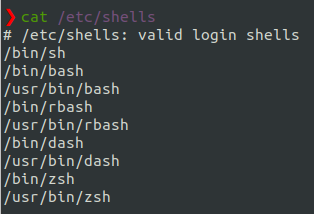  
2. Show current SHELL name
```bash
echo $SHELL
```
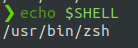  
3. New login shell for the user account
```bash
chsh -s [SHELL_NAME]
```
#### 2. chfn
`chfn` command in Linux allows you to change a user’s name and other details easily. `chfn` stands for **Change finger**.
**Syntax**
```bash
chfn [option] [login]
```
*Note:* Use `sudo` for adminstrator permission
**Options**
1. By default, we use `chfn` without any option, the system will ask from the user itself to change some basic attributes.
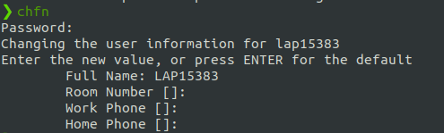  
2. `-f` (fullname): For changing fullname on the account
```bash
sudo chfn -f [Name] [Login_name]
```
3. `-w` (work_phone): For changing the work phone number
```bash
sudo chfn -w [Phone]
```
4. `-r` (room_no): For changing the room number on the account
```bash
sudo chfn -r [Room_no]
```
5. `-h` (home_ph): change the home phone number on the account
```bash
sudo chfn -h [Phone]
```
</details>
<!-- Control Permission -->

#### Controlling permission command
<details> 
<summary>Click to toggle contents of submission <b>Controlling permission command</b></summary>

#### 1. chmod
In Unix-like operating systems, the `chmod` command is used to change the access mode of a file.

**Ownership and Permissions**: To protect and secure files and directory in Linux we use permissions to control what a user can do with a file or directory. Linux uses **three** types of permissions:  `Read`, `Write` and `Execute`

**3 classes of user:** 
+ **User:** These type of file permission affect the owner of the file.
+ **Group:** These type of file permission affect the group which owns the file. Instead of the group permissions, the user permissions will apply if the owner user is in this group.
+ **Other:** These type of file permission affect all other users on the system.

Note: To view the permissions we use:  
```bash
ls -l
```
  
The permission includes 10 fields:
+ The first one indicates a file if `-`, a directory if `d`, a link if `l`
+ 3 group of 3 symbols if the group of permission for 3 type of class: owner, group and other. With 3 symbols for 3 type of permission: read, write and execute.
**Syntax**
```bash
chmod [reference][operator][mode] file... 
```
We have some references for classes whom to give permission:
+ `u`: owner
+ `g`: group
+ `o`: other
+ `a`: all
Now, we have some operators is used to specify how the modes of a file should be adjusted.
+ `+`: Add specified modes to specified classes
+ `-`: Remove specified modes to specified classes
+ `=`: The exact modes for specified classes 
**Note:** Don't put the blank space(s) around operator.
Finally, there are 3 specified modes including:
+ `r`: Permission to read the file
+ `w`: Permission to write (delete) the file
+ `x`: Permission to execute (search) the file   
**Example**
1. Owner Permission
```bash
chmod u=r assgn1_client.c
# Grant for owner only permission to read. So we cannot write or execute it.
```
2. Group permission
```bash
chmod g+w filename
# Add permission write for group onto this file
chmod g-wr filename
# Remove permission (write and read) for group onto this file
```
3. All permission
```bash
chmod ugo+rwx foldername 
# Grant read, write, and execute to everyone.
```

**Change Permission in Numeric**
We can convert 9 field of 3 permissions for 3 classes into numeric. It will becomes 3 numbers (0-7) means 3-bit. The first bits for read permission, second for write permission, third for execute permission. And 3 number corressponding for owner, group and other.
```bash
chmod 777 foldername
# 777 = (1-1-1)(1-1-1)(1-1-1) will give read, write, and execute permissions for everyone.
chmod 327 foldername 
# 327 = (0-1-1)(0-1-0)(1-1-1) will give write and execute (3) permission for the user, w (2) for the group, and read, write, and execute for the users.
```
#### 2. chown
You can set the owner by using “chown” command.
**Syntax**
```bash
chown [OPTION]… [OWNER][:[GROUP]] FILE…
```
**Usage**
1. Change owner of a file
```bash
chown owner_name file_name
# Example
chown master file1.txt
# If master is another user in the system, change owner of file1.txt to master.
```
Moreover, if we are user named *user1* and you want to change ownership to *root* (where your current directory is user1). use `sudo` before syntax.  
```bash
sudo chown root file1.txt
```
2. `-c` option for reporting when a file change is made. `-v` for verbose information for every file processed.

3. Change group ownership
```bash
chown :group1 file1.txt
# Change group ownership of file1.txt to group1
```

4. Change owner as well as group ownership 
```bash
chown master:group1 file1.txt
# Change owner to master and group ownership to group1
```
#### 3. chgrp
All files in Linux belong to an owner and a group. `chgrp` command in Linux is used to change the **group ownership** of a file or directory.
At first, we need to have *administrator permission* to add or delete groups. We can Login as root for this purpose or using `sudo`. In order to add a new group we can use this command:
```bash
sudo addgroup [group_name]
```
**Usage**
1. Change group ownership of a file
```bash
sudo chgrp [file_name] [group_name]
```
2. Change group ownership of a folder
```bash
sudo chgrp [folder_name] [group_name]
```
3. Change group ownership of a folder and all its contents.
```bash
sudo chgrp -R [folder_name] [group_name]
```
</details>

#### File compression command
<details> 
<summary>Click to toggle contents of submission <b>File compression command</b></summary>
<!-- File compression -->

#### 1. tar
The `tar` command is used to compress a group of files into an archive. The command is also used to extract, maintain, or modify tar archives.
**Syntax**
```bash
tar [options] [archive-file] [file or directory to be archived]
```
**Options**
1. Extract an archive
```bash
tar xfv archive.tar
# Extract archive.tar to get whole file that stored. x = extract, f = file, v = verbose
```

2. Create a archive with files and folders
```bash
# Syntax
tar cvf ar.tar file1 file2 ...
```
```bash
tar cvf file.tar *.cpp
# Create a tar file called file.tar which is the Archive of all .cpp file in current directory.
```

3. Show all file of an archive
```bash
tar tvf archive.tar
# show all the file inside archive.tar
```

4. Compression and extraction with **gzip file** by using `-z` option.
```bash
tar cvzf file.tar.gz *.c  
# Compress all file .c into gzip
tar xvzf file.tar.gz
# Extract gzip file
```

#### 2. gzip
`gzip` command compresses files. Each single file is compressed into a single file. If given a file as an argument, gzip compresses the file, adds a **“.gz” suffix**, and *deletes* the original file. With *no arguments*, gzip compresses the standard input and writes the compressed file to standard output.
**Syntax**
```bash
gzip [Options] [filenames]
```
**Example**
```bash
gzip a.txt gzip [Options] [filenames]
# Create compressed file of a.txt, called a.txt.gz and delete original file a.txt 
```
**Options**
1. `-f` option is used to force the operation occurs. Some cases will not working when exist the file.gz that we want to compress.
```bash
gzip -f file.txt
# If file.txt.gz have already existed, the normal command cannot run but with -f option can force this operation.
```
2. `-r` option can compress every file in a folder and its subfolders. This option doesn’t create one file called foldername.gz. Instead, it traverses the directory structure and compresses each file in that folder structure.
```bash
gzip -r folder
# Result: inside the folder and subfolder, each file in it convert into gzip compression.
```
</details>

#### Disk storage management command
<details> 
<summary>Click to toggle contents of submission <b>Disk storage management command</b></summary>

<!-- Disk storage management -->
#### 1. df 
The `df` command (short for disk free), is used to display information related to **file systems** about total space and available space.
  
**Syntax**
```bash
df [option] [file]...
```
**Example**
```bash
df
# If no file name is given, it displays the space available on all currently mounted file systems.
```
**Option**
1. `-a` option: Display all the file system
2. `-h` option: Display size in power of 1024
3. `--total` option: Display complete grand total
#### 2. du 
The `du` command (short for disk usage) is used to estimate file space usage. The `du` command can be used to track the files and directories which are consuming excessive amount of space on hard disk drive.
**Syntax**
```bash
du [option] [file]
```
**Example**
```bash
du .
# Track the amount of space consuming in current woking directory 
```
 
**Options**
1. `-h` option: Print **sizes** in human readable format (K, M, G)
2. `-c` option: Print total size
3. `-a` option: Print all files including directories.

</details>

<!-- System Adminstrator Statistic -->
#### System adminstrator statistic command
<details> 
<summary>Click to toggle contents of submission <b>System adminstrator statistic command</b></summary>

#### 1. htop 
htop is a system monitoring utility that runs on the terminal. It is similar to another commonly used utility called top. But htop is much easier to use. htop program’s user interface is ncurses based and the information representation is really clean and nice
**Installation**
```bash
sudo apt update
sudo apt upgrade
sudo apt install htop
```
**Syntax**
```bash
htop [options]
```
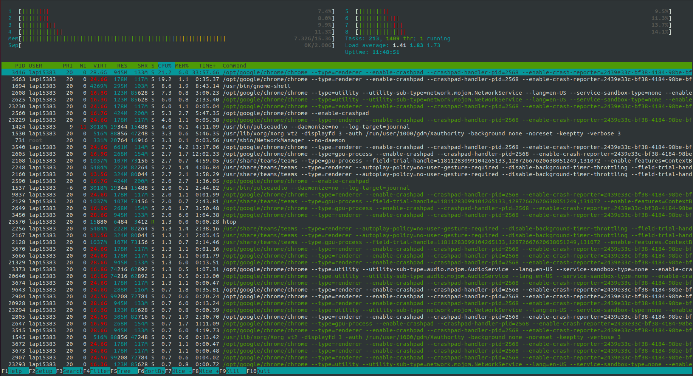  
As we can see some basic information in beautiful UI monitor. For example, how much main memory or RAM is available and how much is used,  uptime of our computer, how much of the CPU is used and some button for searching, quiting,...
#### 2. netstat
`Netstat` is a command-line tool used by *system administrators* to evaluate *network configuration* and activity. The term Netstat is results from **network** and **statistics**. It shows *open ports* on the host device and their corresponding addresses, the routing table, and masquerade connections.
**Installation**
```bash
sudo apt update
sudo apt upgrade
sudo apt install net-tools
```
**Syntax**
```bash
netstat [options]
```
**Options**
1. Listing all the LISTENING PORT of TCP and UDP connections using `-a` option.
2. `-at` option: Listing only TCP port connections.
3. `-au` option: Listing only UDP port connections.
4. `-l` option: Listing all active listening ports connections.
5. `-lt`, `-lu` options corresponding listing all active listening TCP and UDP port.
#### 3. lsof
`lsof` command stands for List Of Open File. This command provides a list of files that are opened. Basically, it gives the information to find out the files which are opened by which process. With one go it lists out all open files in output console. It cannot only list common regular files but it can list a directory, a block special file, a shared library, a character special file, a regular pipe, a named pipe, an internet socket, a UNIX domain socket, and many others. it can be combined with grep command can be used to do advanced searching and listing. 
**Syntax**
```bash
lsof [options] [username]
# List all the files that ore opened by any process in the system
```
</details>
<!-- System Adminstrator Statistic -->

#### Connecting to a Remote Server command
<details> 
<summary>Click to toggle contents of submission <b>Connecting to a Remote Server command</b></summary>
<!-- Connect to a Remote Server -->

#### 1. ssh
The `ssh` command provides a secure encrypted connection between two hosts over an insecure network. This connection can also be used for terminal access, file transfers, and for tunneling other applications.
**Usage**
1. Connect to remote server from Linux client
```bash
ssh sample.ssh.com
```
We can use `-i` option if we need to access the server with private key.
```bash
ssh -i [location_of_private_key] sample.ssh.com
```
2. Execute remote commands on the server
```bash
ssh hostname command
# ssh sample.ssh.com  ls /tmp/doc
# Run command `ls /tmp/doc` on `sample.ssh.com` server 
```
3. Specify a different user name
It is also possible to use a different username at the remote machine by entering the command as:
```bash
ssh alternative-username@sample.ssh.com
# or
ssh -l alternative-username sample.ssh.com
```
#### 2. scp
`SCP` (Secure Copy Protocol) is a network protocol used to securely copy files/folders between Linux (Unix) systems on a network. To transmit, use the **scp command** line utility, a safer variant of the cp (copy) command.
**Syntax**
```bash
scp [option] [user_name@source_host:path/to/source/file] [user_name@target_host:target/path] 
```
If Path in local just write the location as normal. If path in remote server, we need to write with format [username]@[Ip_address]:[server_path]
**Examples**
1. Copy a file from local to remote
```bash
scp Desktop/sample_example.txt root@136.183.142.28:/home/remote_dir
# Copy the file at location 'Desktop/sample_example.txt' in local to remote server with username 'root', IP address '136.183.142.28' and location '/home/remote_dir'
```
We can do the same with copy file from remote to remote, remote to local
2. Copy **multiple** files from local to remote
```bash
scp Desktop/example1.txt Desktop/example2.txt Desktop/example3.txt root@136.183.142.28:/home/remote_dir
```
3. Copy a Folder from Local Host to Remote Server Recursively
```bash
scp -r example root@147.182.143.27:/home/remote_dir
# Copy folder example to location in remote server
```
4. Copy a File with SCP Using a **Specific Port**
At default, SCP uses port **22**. However, if a remote system is configured to listen to SSH requests on a different port, use the `–P` option to specify the port.
```bash
scp -P 2222  Desktop/sample_example.txt root@147.182.143.27:/home/remote_dir
# Copy file using port 2222
```
</details>

### Handy tools
<details> 
<summary>Click to toggle contents of submission <b>Handy tools</b></summary>

#### 1. man
`man` command is used to display the user manual of any command that we can run on the terminal. It provides the detailed views about **NAME, SYNOPSIS,DESCRIPTION, OPTIONS, EXIT STATUS, RETURN VALUES, ERRORS, FILES, VERSIONS, EXAMPLES, AUTHORS and SEE ALSO.**
**Syntax**
```bash
man [options] [command_name]
```
**Example**
```bash
man ls
# Print the information about ls command.
```
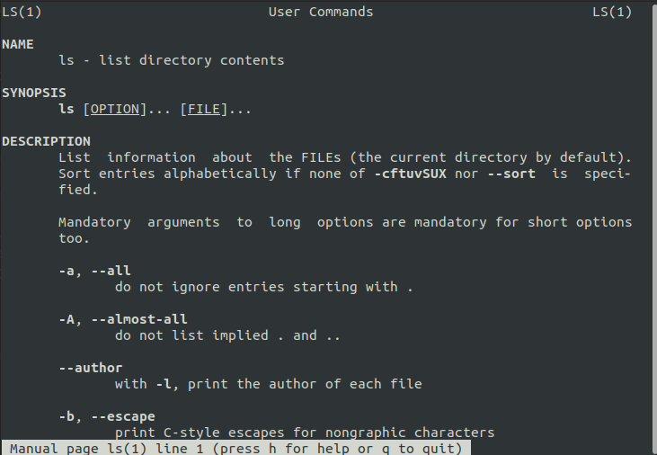  
#### 2. awk
`awk` is a scripting language used for manipulating data and generating reports. The awk command programming language requires no compiling and allows the user to use variables, numeric functions, string functions, and logical operators. Awk is abbreviated from the names of the developers – Aho, Weinberger, and Kernighan. **awk command** can define text patterns that are to be searched for in each line of a document and the action that is to be taken when a match is found within a line. Thus, Awk is mostly used for **pattern scanning and processing**.
**Syntax**
```bash
awk [options] '/pattern/ {action}' input-file > output-file
```
**Usage**
1. Print whole code of file (Default behavior)
```bash
awk '{print}' bump_script.sh
# Same as: cat bump_script.sh
```
2. Print the lines which match the given pattern. 
```bash
awk '/if/ {print}' bump_script.sh
# Print lines that contains 'if' pattern
```
3. Splitting a Line Into Fields
For each line, the **awk command** splits the record delimited by whitespace character by default and stores it in the \$n variables. If the line has 4 words, it will be stored in \$1, \$2, \$3 and \$4 respectively. Also, \$0 represents the whole line.  
```bash
awk '{print $1,$4}' employee.txt
# Print the first and forth words in a line. 
```
4. Display Line number
```bash
awk '{print NR,$0}' employee.txt 
# NR count from 1 the index of line
```

#### 3. grep
The `grep` filter searches a file for a particular pattern of characters, and displays all lines that contain that pattern. The pattern that is searched in the file is referred to as the regular expression.
**Syntax**
```bash
grep [options] pattern [files]
```
**Usage**
1. Case insensitive search 
```bash
grep -i "UNix" abc.txt
# It will find all line match pattern such as 'Unix', 'unix', 'uNIx'
```
2. Count number of match
```bash
grep -c 'unix' abc.txt
```
3. Display file name matches the pattern
```bash
grep -l "unix" *
# or
grep -l 'unix' f1.txt f2.txt ...
```
4. Display only the matched pattern
```bash
grep -o "unix" a.txt
# Use for find all patterns similar with the given reg-ex.
grep -o -E "[0-9]*" a.txt
```

#### 4. man
`man` command in UNIX stands for stream editor and it can perform lots of functions on file like searching, find and replace, insertion or deletion

**Syntax**
```bash
sed OPTIONS... [SCRIPT] [INPUTFILE...] 
```
**Usage**
1. Substitude string
`s`: specifies the substitution operation, `/` are delimeters.
```bash
sed 's/[pattern]/[replacce]/x' [file_name]
# Example
sed 's/unix/linux/' a.txt
# Replace unix into linux in each line. By default, the sed command replaces the first occurrence of the pattern in each line.
sed 's/unix/linux/3' a.txt
# Replace the third occurrence pattern
sed 's/unix/linux/g' a.txt
# Replace all the occurrences
sed 's/unix/linux/3g' a.txt
# Replace third pattern to the end.
```

<!-- Regex -->
#### 5. Regex
`Regular expression` is also called **regex** or **regexp**. It is a very powerful tool in Linux. Regular expression is a pattern for a matching string that follows some pattern. Regex can be used in a variety programs such as grep, sed, bash, vi,... There are some rules about Regex:
+ `.`: replaces any char. E.g: 'a.b' matches with 'axb', 'acb',..
+ `\`: special char. E.g: 'a\(b' matches with 'a(b'
+ `-`: range number or letter. E.g: '[0-9]' matches '1', '5',...
+ `*`: matches zero or more times the preceding character. E.g: '[0-9]*' match '', '1', '1234',...
</details>

### Git
#### Git definition
<details> 
<summary>Click to toggle contents of submission <b>Git definition</b></summary>

#### 1. Change
`Change` is just an adjustment, more update or promote the code, upgrade the status of repository. To capture this snapshot of a state current git, we need to use `git commit`.
#### 2. Commit
`Commits` are the core building block units of a Git project timeline. Commits can be thought of as snapshots or milestones along the timeline of a Git project. Commits are created with the git commit command to capture the state of a project at that point in time.
#### 3. Stage
`Staging` is a step before the commit process in git. That is, a commit in git is performed in two steps: staging and actual commit. As long as a changeset is in the **staging area**, git allows you to edit it as you like (replace staged files with other versions of staged files, remove changes from staging, etc.).
#### 4. Branch 
A `branch` in Git is simply a lightweight movable pointer to one of these commits. The default branch name in Git is master. As you start making commits, you’re given a master branch that points to the last commit you made. Every time you commit, the master branch pointer moves forward automatically. This is the first principle for many feature in git such as create new branch or merge branches.
  
#### 5. Tag
Git has the ability to `tag` specific points in a repository’s history as being important. Typically, people use this functionality to mark release points (v1.0, v2.0 and so on).
Git supports 2 types of tags: **lightweight** and **annotated**.
+ A **lightweight tag** is very much like a branch but doesn’t change after a commit —  it’s just a pointer to a specific commit (fixed).
+ Annotated tags, however, are stored as **full objects** in the Git database. They’re checksummed; contain the tagger name, email, and date; have a tagging message; and can be signed and verified with GNU Privacy Guard (GPG). 

In conclusion, it’s generally recommended that we create **annotated tags** for storing this information while if we want a temporary tag or for some reason don’t want to keep the other information, **lightweight tags** are available too. 
#### 6. Repository
**`Repositories`** in GIT contain a collection of files of various different versions of a Project. These files are imported from the repository into the local server of the user for further updations and modifications in the content of the file. A VCS or the Version Control System is used to create these versions and store them in a specific place termed as a repository. The process of copying the content from an existing Git Repository with the help of various Git Tools is termed as **cloning**. Once the cloning process is done, the user gets the complete repository on his local machine. Git by default assumes the work to be done on the repository is as a user, once the cloning is done.
#### 7. Head
`Head` is the pointer points to `CURRENT COMMIT`. We can use `git checkout` command for changing HEAD revision changes to point tip of new branch. Apart from it, we can use `git reset` to change HEAD point commit we want.
</details>


#### Git command
<details> 
<summary>Click to toggle contents of submission <b>Git definition</b></summary>

#### 1. git pull
`Git pull` command is used to fetch data from **Remote repository** and update **Local repository** to be available with that data. In advance, `git pull` is the combination of `git fetch` and `git merge`.
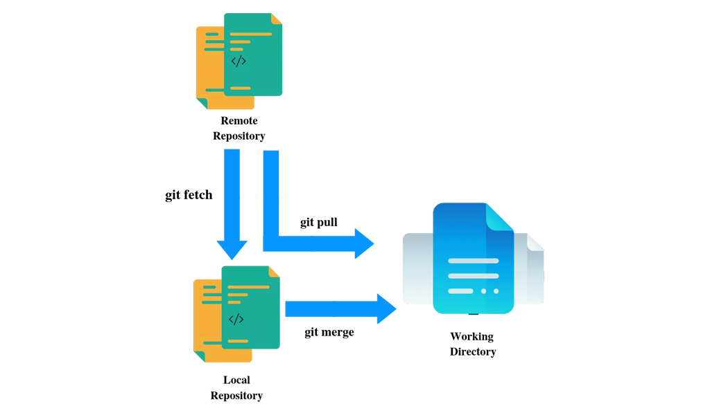  
With `git fetch` command, we can check the conflict between the current version of source code on remote repo compare with local repo (but do not change the state of lcoal repo). After solve completely the conflict, this operation will `git merge` the branch on the remote onto the current branch on local and create new commit. HEAD pointer will update to be pointed to that new merge commit.
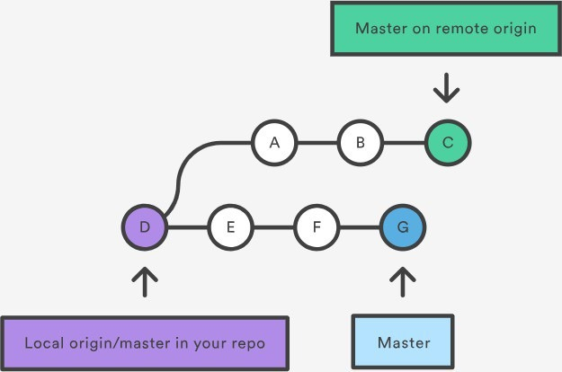  
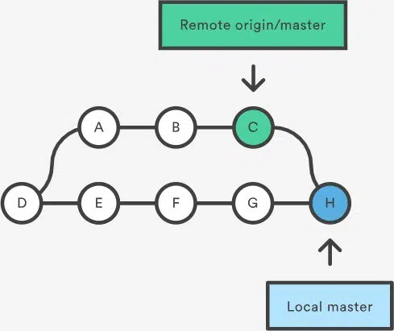  
**Usage**
1. Pull from remote server
```bash
git pull <remote>
# Example
git pull origin master
# To sync Remote repo to Local repo, with name of repo is 'origin' and branch's name is 'master' 
```
2. Pull but not create new merged commit with option `-no-commit`
```bash
git pull -no-commit <remote>
```
3. Pull with the same `git rebase` mechanism by using option `-rebase`
```bash
git pull -rebase <remote>
```
4. Pull and display more information about changes and updated files by using option `-verbose`
```bash
git pull -verbose <remote>
```

#### 2. git push  
`git push` command is used to push one or many commits from Local repo to Remote repo. The default source is the current branch that HEAD pointer is pointing. We can choose the specified branch that we want to push if we don't have the connection between source and destination before. Moreover, this command can delete a branch on remote. 
**Options**
1. `--all`: push all branches to server
2. `--tags`: push all tags to server
3. `--delete`: delete a choosen branch we want
4. `-u`: push and create a upstream corresponding with branch on local. This wiil use on the irst time push to remote.
**Usage**
1. For the first time upload
```bash
git push -u origin master
# create upstream between local and remote with name 'origin' and branch 'master'
# From now on, we just use:
git push
```
2. Push all branches
```bash
git push origin --all
```
3. Delete branch
```bash
git push origin --delete beta
# Del branch beta
```
#### 3. git reset
`git reset` is used to reset current HEAD pointer to the specified state.
**Options**
1. `--soft`: Reset the HEAD pointer and delete the forward commit. Any changes in lastest commits will be put into the **staging area**. By this way, we still have a chance to re-commit or change something after next commit.
```bash
git reset --soft HEAD~x
# We can choose x= 1,2,3... This is the number of parent node we want to backward
```
2. `--hard`: Reset and delete the forward commit. This mechanism is the same as `--soft` option, but any changes in lastest commits we delete permanently instead of putting into staging area. Use this option when we don't want to see the commit anymore for some reasons.
```bash
git reset --hard HEAD~2
```
3. `--mixed`: This is the default option. This is similar with `--soft` option, the HEAD pointer will backward some steps and any changes in the latest commit will put in the **Untracked file** (or **working directory**). It's waiting for `git add` command to be put into **Staging area**.
```bash
git reset HEAD~2
# or
git reset --mixed HEAD~2
```
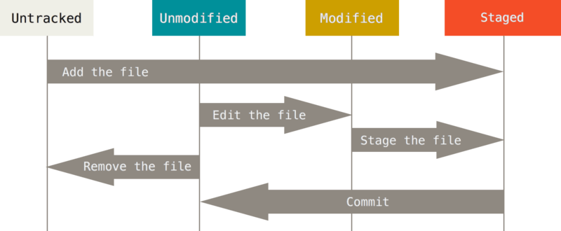  
**Note:** About the `HEAD pointer`
If we don't put any argument into this command. It's default backward 1 step. There are some rule to write HEAD pointer
+ `HEAD` is the current commit we are working
+ `HEAD~1` is the parent commit of HEAD on the **same branch**. To be extended, `HEAD~n` will be the n-step backward of HEAD on the **same branch**.
+ `@` can replace `HEAD`
+ `HEAD^1` is the first parent commit is the **most recent submission** of HEAD (about the time not same branch). The same will the extended `HEAD^n`

#### 4. git rebase
`git rebase` command is used to reapply commits on top of another base tip. This is another way to merge 2 branch instead of using `git merge`
**Example**
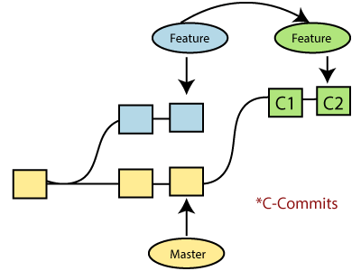  
As we can see in the image above, we want to merge the branch **feature** and **master**. There are 2 ways to implement it.

+ The first one:
```bash
git checkout master # On branch master
git merge feature
```
In this way, we will create new merge commit and master branch will point to this new commit.
+ The second one:
```bash
git checkout feature # On branch feature
git rebase master
```
In this way, at first, it will find the first ancestor node commit of both branch. After this, the branch feature will cut the segment from this ancestor node to feature branch point to, move it and apply it on the top master branch. Now we have the commit branch line is **straight forward**.


#### 5. Git vs Github vs Gitlab    
+ `Git` is a **version control system**(VCS) that lets you manage and keep track of your source code history.
+ `GitHub` is a cloud-based hosting service that lets you manage **Git repositories**. If you have open-source projects that use Git, then GitHub is designed to help you better manage them. 
+ `GitLab` is a cloud-base hosting service that manage Git repo similar as **Github**. The key differences is Github focus on **speed** first while GitLab concentrates on **reliability**. Apart from it, *GitLab* has **Continuous Integration/Continuous Delivery** (CI/CD) and DevOps workflows build-in whereas *GitHub* need users integrate them yourself by third-party CI program such as Jenkins, CircleCI or TravisCI. 

</details>

<!--  Pile -->

<!--  > = Override -->
<!--  >> = Append -->
<!--  |  = Get output to be input -->

## Assignment 2
> Try to customize your shell, the way you want and proud of, then screenshot and share with us in your submission.

I use the custom theme in [powerlevel10k](https://github.com/romkatv/powerlevel10k) for my terminal and this is the result:
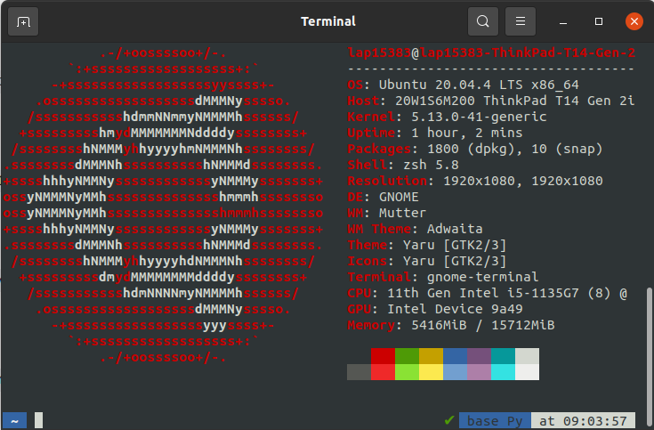  


## Assignment 3
> Register a VPS, try out stuffs you have learned, and have fun with it.

In this project, I use [VNG data center](https://ce.engineering.vng.vn/) in order to create a new VPS instance. With the domain of VNG, we currently have **350000 coins** free and this coin will reset to **350000 coins** each week.


We will do the following step to create a new VPS instance.
1. Click `lauch instance` button.
2. Choose **Amazon Web Services**, choose the region **AP** at **Singapore**. Click next.
3. Choose the OS is Linux/Unix Canonial, Ubuntu, **20.04** LTS, amd64. Click next.
4. Choose **t2.micro** with 1 CPU, 1 GiB, price 600 coin per hour. Click next.
5. Choose `Create new Keypair` and download private key of vps instance. Click review and launch.
6. Waiting for new instance initializing.

Next, we open the normal terminal in linux.
```bash
chmod 400 private_key_location #set read permission to user
ssh -i private_key_location ubuntu@public_id #Replace the private_key we have downloaded before and public ID of VPS.
```
Now, we are in new vps server. :)
```bash
cd ~/.ssh
vi authorized_keys
```
Comeback to the local terminal.
```bash
cd ~/.ssh
vi *.pub #Go to file public key in local
# Copy this key to clipboard
```
Back to vps server, add the public key of local in the next line of file authorized_keys. From now, we can access without private key of vps server. In addition, we can evaluate this assignment by add the judge's public key, and they can access due to the private key of local. Moreover, an instance can start, stop or terminate the reduce the cost.


## Assignment 4
> Write a script in order to bump the version of a software. Input is the file contain the part of the version we need to increase. Output is the input file but with version string modified.

#### Usage
```bash
bash bump_script.sh [Option] [Filename]
```
**[Option]**: 
+ `patch`: the program will bump **patch version**.
+ `minor`: the program will bump **minor version**.
+ `major`: the program will bump **major version**. 

#### Flowchart


#### Upload the script to VPS
Make sure VPS server turn on, go to local terminal and enter the following command to copy the **bump_script** from local to the VPS server.
```bash
scp bump_script.sh ubuntu@xxx.xxx.xxx:/home/ubuntu #Copy a File from Local to Remote Server
exit #logout the remote 
```


<!-- scp vs rsync -->

<!-- | (vertical)

The vertical bar | is commonly referred to as a "pipe". It is used to pipe one command into another. That is, it directs the output from the first command into the input for the second command.


grep -E -o 'finalNumber="[0-9]+"' file.xml | grep -E -o '[0-9]+'
Use -E for extended regular expressions, and -o to print only the matching part. -->


## Assignment 5
The elevator project have the 