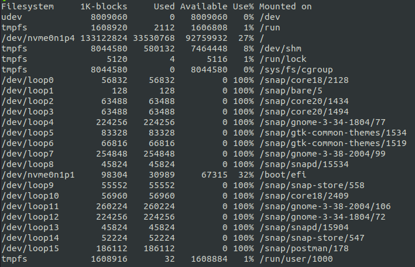
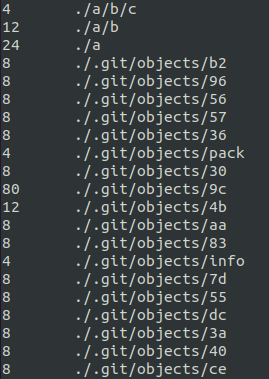
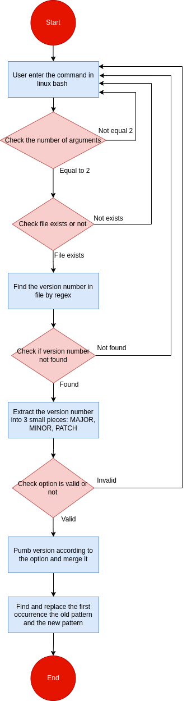

## Assignment 1
> Try to answer the questions throughout this module (including next week's), note down your takeaway into your submission. We will learn from each other's notes.

<!-- Know your mission -->
### Know your mission
#### What is backend programming?


#### What are the differences backend and frontend programming?


#### What do you need to be a backend engineer?


#### Can we deliver our products without a backend?


#### What is backendless? 


<!-- Know your environment -->
### Know your environment
#### Linux vs Unix? Is Linux a Unix?

#### Is Ubuntu a Linux? How about CentOS? What are Linux distros?


#### Is macOS a Linux distro?

#### What is Linux file system? Everything is a file? What is file descriptor?

#### How does Linux file permission work?


#### Blocking vs Non-blocking I/O?


#### Process vs Thread?
#### Multi-threading


#### Parallel vs Concurent vs Asynchronous

##### Race condition, deadlock


##### Context switching


##### Mutex vs Semaphore


#### Memory layout: stack, heap


#### The shell
1. Bash vs Zsh vs Terminal vs Sh vs....
2. Login shell vs Interactive shell
3. Settings
4. Variables

<!-- Know your tools -->
### Know your tools
#### Basic command

##### echo
This command will display a line of text. 
**Syntax:**
```bash
echo [option] [string]
```
**Example:** 
```bash
echo "Hello Word" # Print Hello World
echo Hello World # Print Hello World
```
**Option**
1. `-e`: Enables the interpretation of backslash escapes (such as \b, \n,..)
```bash
echo "Hello \b Word \t 1234 \n Quach Minh Tuan" 
# Hello Word 	 1234 
#  Quach Minh Tuan
```
2. `echo *`: will print all files, same with `ls` command
3. `-n`: will print trailing newline
```bash
echo -n "Hello Word"  # Print Hello World without newline
```
##### - cat
`cat` is the acronym of **concatenate**. It will read data from the file and gives their content as output. It frequently uses for view file    
This command will display a line of text. 
**Syntax:**
```bash
cat [filename]
```
**Option:**
1. View multiple files 
```bash
cat [filename1] [filename2] # It will show the content of file1 and file2
```
2. View files preceding with line numbers
```bash
cat -n [filename]
# 1 This is QMT
# 2 Hello World
```
3. Create a file and edit in it
```bash
cat > newfile
```
4. Copy the contents of one file to another file.
```bash
cat [start-file] > [destination-file]
```
5. Append the contents of start-file to **the end** of destination-file
```bash
cat [start-file] >> [destination-file]
```
6. Suppress repeated empty lines
```bash
cat -s [filename]
# If the file is:
# asdfasdf


# asdf
# Output: 
# asdfasdf

# asdf
```
##### ls
`ls` command uses for list the directory contents.
**Syntax**
```bash
ls [option] [file]
```
**Option**
1. List the hidden files with `ls -a` command.
2. List file in long format with `ls -l`
+ content permissions
+ number of links to the content
+ owner of the content
+ group owner of the content
+ size of the content in bytes
+ last modified date / time of the content
+ file or directory name

3. We can combine 2 options above by using `ls -la` command.
##### cd 
Using `cd` command for changing the *current working directory* in linux or other Unix-like OS. 
**Syntax**
```bash
cd [Option] directory
```
**Example**
```bash
cd Hello World
# Go to the Hello World directory
```
##### pwd
The command `pwd` (stand for **print working directory**) prints the *current working directory* path starting from root (/). This is useful when we get stuck in the Linux file system structure maze.
**Syntax**
```bash
pwd [Option]
```
**Example**
```bash
pwd
# Print /home/lap15383
# The current working directory is /home/lap15383
```

<!-- Find command -->

##### which
`which` command can find the full path of the **command**, executables.
**Syntax**
```bash
which [option] [command1] [command2] [...]
```
**Example**
```bash
which python abc java
# /home/lap15383/anaconda3/bin/python
# abc not found
# /usr/bin/java
# Explain: the python and java command full link path is existed and is shown on the terminal while abc command is not found
```
**Option**
Option `-a` can print all matching pathnames of each argument.
```bash
which -a touch
# /usr/bin/touch
# /bin/touch
# Explain: this will show 2 full path of touch command. This case happens when 2 versions of the same command installed in different locations or totally different commands using the same name.
```
##### whereis
`whereis` command uses for searching the *binary, source and manual files* for the command specified as an argument. By default, it searches for the command's files in the *hard-coded paths* and directories listed in the *environment variables*. 
**Syntax**
```bash
whereis [option] [filename1] [filename2] [...]
```
**Example**
```bash
whereis bash
# bash: /usr/bin/bash /etc/bash.bashrc /usr/share/man/man1/bash.1.gz
# Explain: 'bash' is the command for which you want to get information, '/bin/bash' and '/etc/bash.bashrc' is the path to the binary file, there is no source file, and '/usr/share/man/man1/bash.1.gz' is the man page. To be more clearly, let's go the option.
```
**Option**
Option `-b`, `-s`, `-m` corresponding search only for the *binary, source and manual files* for the command specified as an argument.
```bash
whereis -b bash
# bash: /usr/bin/bash /etc/bash.bashrc
whereis -s bash
# bash: 
whereis -m bash
# bash: /usr/share/man/man1/bash.1.gz
```
##### locate
The `locate` command finds files in Linux using the file name. `locate` is used for obtaining instantaneous results, and it is an essential utility when speed is a priority. But this command is not already installed in Ubuntu so we need to install manually.
**Installation**
```bash
sudo apt update
sudo apt install mlocate
```
**Syntax**
```bash
locate [options] [pattern]
```
**Example**
```bash
locate bump_script.sh
# /home/lap15383/Backend_1/bump_script.sh
# All locations that filename is 'bump_script.sh' include /home/lap15383/Backend_1/bump_script.sh.
```
##### find
`find` command in UNIX use for finding file and directories and perrform subsequent operations on them.
**Syntax**
```bash
find [options] [path...] [expression]
```
+ The `options` attribute controls the treatment of the symbolic links, debugging options, and optimization method.
+ The `path..`. attribute defines the starting directory or directories where find will search the files.
+ The `expression` attribute is made up of options, search patterns, and actions separated by operators.

**Examples**
1. Find file by names
```bash
find . -name bump_script.sh
# Search for files by name in current working directory
```
2. Find file by extension
```bash
find . -name *.md
# Search for files by extension (ending regex '.md') in current working directory
```
<!-- Interact with file: Create + Move + Copy -->
##### mkdir
`mkdir` command in Linux/Unix allows users to create new directory. It stands for *make directory*
**Syntax**
```bash
mkdir [option] dir_name
```
**Options**
1. Create multiple directories at the same time.
```bash
mkdir {dir1,dir2,dir3} #No space inside the curly brackets
```
2. Make parent directories by using options `-p`. Sometimes, we want to create a structure with multiple *subdirectories* such as we not only want to create a folder name *a*, but also a structure, *a/b/c*
```bash
mkdir -p a/b/c
```
We can check it by using `tree` command.
3. Set permission when making a directory. By default, mkdir just give *rwx* permissions for the current user only for reading, writing, executing. Now we can control it by using `-m` options adding with permissions we want.
```bash
mkdir -m777 abc
# All users (current user, group users, other users) can access with read, write, execute permissions.
```
##### cp
`cp` stands for *copy*. This command is used to copy files or group of file or directory. `cp` command require at least 2 filenames in its arguments.
**Syntax**
1. Copy two file names
If the command contains two file names, then it copy the contents of *1st file* to the *2nd file*. If the *2nd file* doesn’t exist, then first it *creates* one and content is *copied* to it. But if it existed then it is simply *overwritten* without any warning.
```bash
cp src_file dest_file
```
2. Copy multiple files into a directory
This command copies each source file to the destination directory with the same name, created if not existed but if already existed then it will be overwritten.
```bash
cp src_file1 src_file2 src_file3 Dest_directory
# The result after this command, we will create a new Dest_dir if not exist and copy or create new file or overwrite src_file1, src_file2, src_file3 in Dest_dir.
```
3. Copy directory to directory using options `-R`
```bash
cp -R Src_directory Dest_directory
```
##### mv
`mv` stands for *move*. `mv` command is used to move one or more files or directories from one place to another in a file system.
**Syntax**
```bash
mv [option] source destination
```
If the destination file doesn’t exist, it will be created. In the above command mv simply replaces the source filename in the directory with the destination filename(new name). If the destination file exist, then it will be overwrite and the source file will be deleted. By default, mv doesn’t prompt for overwriting the existing file.
**Example**
```bash
cat a.txt
# India

cat b.txt
# geeksforgeeks

mv a.txt b.txt

cat b.txt
# India

# Explain: Now the file a.txt will lost and replace by b.txt. But b.txt is already existed so it overwrites.
```
##### touch
The `touch` command is a standard command used in UNIX/Linux operating system which is used to create, change and modify timestamps of a file. It similars to `cat` command but it will create file with content while `touch` command create file without any content (empty)
**Syntax**
```bash
touch filename1 filename2 filename3 ...
# Result: Create empty file with filename: filename1, filename2, filename3.
```
**Options**
`-a` is used to change or update the last access or modification times of a file.
```bash
touch -a filename
```
##### rm
`rm` stands for remove here. `rm` command is used to remove objects such as files, directories, symbolic links and so on from the file system. *By default, it does not remove directories.*
**Syntax**
```bash
rm [OPTION] FILE
```
**Options**
1. `-r` (Recursion Deletion) is used to delete directory. It performs a tree-walk and will delete all the files and sub-directories recursively of the parent directory.
```bash
rm -r DIR_NAME
```
2. `-f` (Force Deletion): rm prompts for confirmation removal if a file is write protected.
```bash
rm -f FILE
```

<!-- Now  -->
##### ln


##### chgrp

##### chsh
##### chfn
##### chown
##### chmod

<!-- File compression -->

##### tar
The `tar` command is used to compress a group of files into an archive. The command is also used to extract, maintain, or modify tar archives.
**Syntax**
```bash
tar [options] [archive-file] [file or directory to be archived]
```
**Options**
1. Extract an archive
```bash
tar xfv archive.tar
# Extract archive.tar to get whole file that stored. x = extract, f = file, v = verbose
```

2. Create a archive with files and folders
```bash
# Syntax
tar cvf ar.tar file1 file2 ...
```
```bash
tar cvf file.tar *.cpp
# Create a tar file called file.tar which is the Archive of all .cpp file in current directory.
```

3. Show all file of an archive
```bash
tar tvf archive.tar
# show all the file inside archive.tar
```

4. Compression and extraction with **gzip file** by using `-z` option.
```bash
tar cvzf file.tar.gz *.c  
# Compress all file .c into gzip
tar xvzf file.tar.gz
# Extract gzip file
```

##### gzip
`gzip` command compresses files. Each single file is compressed into a single file. If given a file as an argument, gzip compresses the file, adds a **“.gz” suffix**, and *deletes* the original file. With *no arguments*, gzip compresses the standard input and writes the compressed file to standard output.
**Syntax**
```bash
gzip [Options] [filenames]
```
**Example**
```bash
gzip a.txt gzip [Options] [filenames]
# Create compressed file of a.txt, called a.txt.gz and delete original file a.txt 
```
**Options**
1. `-f` option is used to force the operation occurs. Some cases will not working when exist the file.gz that we want to compress.
```bash
gzip -f file.txt
# If file.txt.gz have already existed, the normal command cannot run but with -f option can force this operation.
```
2. `-r` option can compress every file in a folder and its subfolders. This option doesn’t create one file called foldername.gz. Instead, it traverses the directory structure and compresses each file in that folder structure.
```bash
gzip -r folder
# Result: inside the folder and subfolder, each file in it convert into gzip compression.
```
<!-- Disk storage management -->
##### df 
The `df` command (short for disk free), is used to display information related to **file systems** about total space and available space.
  
**Syntax**
```bash
df [option] [file]...
```
**Example**
```bash
df
# If no file name is given, it displays the space available on all currently mounted file systems.
```
**Option**
1. `-a` option: Display all the file system
2. `-h` option: Display size in power of 1024
3. `--total` option: Display complete grand total
##### du 
The `du` command (short for disk usage) is used to estimate file space usage. The `du` command can be used to track the files and directories which are consuming excessive amount of space on hard disk drive.
**Syntax**
```bash
du [option] [file]
```
**Example**
```bash
du .
# Track the amount of space consuming in current woking directory 
```
 
**Options**
1. `-h` option: Print sizes in human readable format (K, M, G)
2. `-c` option: Print total size
3. `-a` option: Print all files including directories.

##### htop 
##### netstat
##### lsof
##### ssh
##### scp

#### Git definition
##### Change
##### Commit
##### Stage
##### Branch 
##### Tag
##### Repository
##### Head

#### Git command
##### git pull

##### git push
##### git fetch
##### git reset
##### git rebase


#### Git vs Github vs Gitlab


<!--  Pile -->

<!--  > = Override -->
<!--  >> = Append -->
<!--  |  = Get output to be input -->

## Assignment 2
> Try to customize your shell, the way you want and proud of, then screenshot and share with us in your submission.

Use the library powerlevel10k, 
Hello World

## Assignment 3
> Register a VPS, try out stuffs you have learned, and have fun with it.

In this project, I use [VNG data center](https://ce.engineering.vng.vn/) in order to create a new VPS instance. With the domain of VNG, we currently have **350000 coins** free and this coin will reset to **350000 coins** each week.


We will do the following step to create a new VPS instance.
1. Click `lauch instance` button.
2. Choose **Amazon Web Services**, choose the region **AP** at **Singapore**. Click next.
3. Choose the OS is Linux/Unix Canonial, Ubuntu, **20.04** LTS, amd64. Click next.
4. Choose **t2.micro** with 1 CPU, 1 GiB, price 600 coin per hour. Click next.
5. Choose `Create new Keypair` and download private key of vps instance. Click review and launch.
6. Waiting for new instance initializing.

Next, we open the normal terminal in linux.
```bash
chmod 400 private_key_location #set read permission to user
ssh -i private_key_location ubuntu@public_id #Replace the private_key we have downloaded before and public ID of VPS.
```
Now, we are in new vps server. :)
```bash
cd ~/.ssh
vi authorized_keys
```
Comeback to the local terminal.
```bash
cd ~/.ssh
vi *.pub #Go to file public key in local
# Copy this key to clipboard
```
Back to vps server, add the public key of local in the next line of file authorized_keys. From now, we can access without private key of vps server. In addition, we can evaluate this assignment by add the judge's public key, and they can access due to the private key of local. Moreover, an instance can start, stop or terminate the reduce the cost.


## Assignment 4
> Bump script
We use the library, 

#### Usage
```bash
bash bump_script.sh [Option] [Filename]
```
**[Option]**: 
+ `patch`: the program will bump **patch version**.
+ `minor`: the program will bump **minor version**.
+ `major`: the program will bump **major version**. 

#### Flowchart


#### Upload the script to VPS
Make sure VPS server turn on, go to local terminal and enter the following command to copy the **bump_script** from local to the VPS server.
```bash
scp bump_script.sh ubuntu@xxx.xxx.xxx:/home/ubuntu #Copy a File from Local to Remote Server
exit #logout the remote 
```
 


<!-- scp vs rsync -->

<!-- | (vertical)

The vertical bar | is commonly referred to as a "pipe". It is used to pipe one command into another. That is, it directs the output from the first command into the input for the second command.


grep -E -o 'finalNumber="[0-9]+"' file.xml | grep -E -o '[0-9]+'
Use -E for extended regular expressions, and -o to print only the matching part. -->