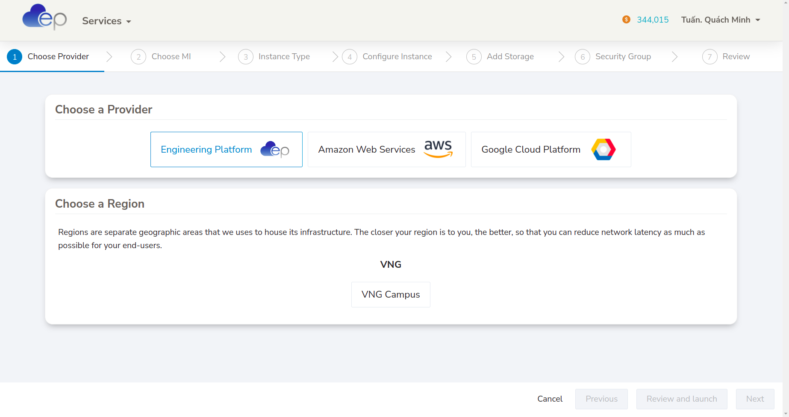

## Assignment 1
> Try to answer the questions throughout this module (including next week's), note down your takeaway into your submission. We will learn from each other's notes.

<!-- Know your mission -->
### Know your mission
#### What is backend programming?
Coding behind the front-end, deal and solve the complex algorithm and operation behind such as interact with Database, concern about the performance, delay,... At all, Backend Programming makes the Front-end task more easier.
#### What are the differences backend and frontend programming?
Front end development is programming which focuses on the visual elements (UI) of a website or app that a user will interact with (the client side) and optimize the user expirence (UX). Meanwhile, back end development focuses on the side of a website users can't see (the server side).
#### What do you need to be a backend engineer?
A backend engineer is responsible for designing, building, and maintaining the server-side of web applications. So we need to know the basic things such as Coding (Object-oriented, Functional programming), Back-end programming language (PHP, Python, Java,..), write documentation, testing, problem-solving, design system and know about front-end.

#### Can we deliver our products without a backend?
Yes. But it just work on the small-scale project, handle with small transaction per second, task may load too slow and not restricted in some feature.

#### What is backendless? 
Backendless is an application development platform which has been designed to serve individual developers as well as software agencies. This can provide end to end solutions which are designed for mobile or web development. Some key feature that Backendless app support including Database (Sql, Nosql,...), Cloud Code, Caching, Geolocation, Codeless, Security, Real-time data,...

<!-- Know your environment -->
### Know your environment
#### Linux vs Unix? Is Linux a Unix?
Key difference between **Linux** and **Unix**:
+ About source code, **Linux** source code is avaiable to general *public* whereas **Unix** soruce code is *proprietary*.
+ About the first release, **Linux** is an operating system built by Linus Torvalds at the University of Helsinki in 1991 while **UNIX OS** was created in the late 1960s at AT&T Bell Labs. 
+ About the default shell, **Linux** shell is *BASH* while **UNIX** shell is *Bourne Shell*.
+ About the version, **Linux** have some crucial versions including Redhat, **Ubuntu**, OpenSuse,... while that of **Unix** are HP-UX, AIS, BSD,...
+ About the security, **Linux** threat detection and solution are very fast while **Unix** users require longer wait times to get the proper bug fixing patch.

Linux is a **clone** of Unix or we can say Linux is actually a UNIX variant based somewhat on Minix, which is a UNIX variant. So **Linux is a Unix**.
#### Is Ubuntu a Linux? How about CentOS? What are Linux distros?
As we mention before, `Ubuntu` is a Linux distribution based on **Debian** and composed mostly of free and open-source software. **So Ubuntu is a Linux**.

`CentOS`, from Community Enterprise Operating System also known as CentOS Linux is a **Linux distribution** that provides a free and open-source community-supported computing platform, functionally compatible with its upstream source and **Red Hat Enterprise Linux** (RHEL). So, CentOS is a version of Linux, **CentOS is a Linux**.

`Linux Distro` stands for **Linux distribution**. It is an OS made from a software collection that includes the **Linux Kernel** and often package management system. Due to Linux kernel is open-source, this allows developers can reuse and choose some feature and develop new Linux Distro. Thus, there are many Linux Distro created base on inheriting some other Linux Distro with new feature and new name. Linux users usually obtain their operating system by downloading one of the *Linux distributions*. Some popular Linux distro such as Red Hat Enterprise Linux (RHEL), CentOS, Debian, Ubuntu, Fedora, Arch,...

#### Is macOS a Linux distro?
No. `MacOS` is a somewhat distant derivative of BSD, a version of Unix developed at UC Berkeley. MacOS is officially still considered a version of Unix (unlike Linux, which is merely Unix-like), though home users rarely encounter it in that capacity. About **Linux**, it's not a OS at all, it's a **kernel** - the part of an OS that handles directly controlling the hardware in response to requests by the applications, or other parts of the OS. In conclusion, *MacOS* doesn't contain the *Linux kernel*, so **it isn't a Linux Distro**.

#### What is Linux file system? Everything is a file? What is file descriptor?
#### 1. Linux file system
A `Linux file system` is a structured collection of files on a disk drive or a partition. A partition is a segment of memory and contains some specific data. In our machine, there can be various partitions of the memory. Generally, every partition contains a file system.

The Linux file system contains the following sections:
+ The root directory (/)
+ A specific data storage format (EXT3, EXT4, BTRFS, XFS and so on)
+ A partition or logical volume having a particular file system.

About the functionality, `Linux file system`, is generally a built-in layer of a Linux operating system, used to handle the data management of the storage. It helps to arrange the file on the disk storage. It manages the file name, file size, creation date, and much more information about a file.

About the feature, `file system` creates a **tree structure**. All the files are arranged as a tree and its branches. The topmost directory called the root (/) directory. All other directories in Linux can be accessed from the root directory.
  

About the type, initially, when we install the Linux OS, Linux offers many file systems such as **Ext, Ext2, Ext3, Ext4, JFS, ReiserFS, XFS, btrfs, and swap**.
  

#### 2. Everything is a file
<!-- "On a UNIX system, everything is a file; if something is not a file, it is a process." -->
**“In Linux, everything is a File”**
This statement is true because there are special files that are more than just files (named pipes and sockets, for instance), but to keep things simple, saying that everything is a file is an acceptable generalization. A Linux system, just like UNIX, makes no difference between a file and a directory, since a directory is just a file containing names of other files. Programs, services, texts, images, and so forth, are all files. Input and output devices, and generally all devices, are considered to be files, according to the system.

#### 3. File descriptor
To be more specific, 


#### How does Linux file permission work?


#### Blocking vs Non-blocking I/O?


#### Process vs Thread?
#### Multi-threading


#### Parallel vs Concurent vs Asynchronous

##### Race condition, deadlock


##### Context switching


##### Mutex vs Semaphore


#### Memory layout: stack, heap


#### The shell
Shell is an interactive user interface with an operating system and can be considered an outer layer of the operating system. The bash shell is one of the most widely used login shells in Linux

1. Bash vs Zsh vs Terminal vs Sh vs....
2. Login shell vs Interactive shell
3. Settings
4. Variables

<!-- Know your tools -->
### Know your tools
#### Basic command

##### echo
This command will display a line of text. 
**Syntax:**
```bash
echo [option] [string]
```
**Example:** 
```bash
echo "Hello Word" # Print Hello World
echo Hello World # Print Hello World
```
**Option**
1. `-e`: Enables the interpretation of backslash escapes (such as \b, \n,..)
```bash
echo "Hello \b Word \t 1234 \n Quach Minh Tuan" 
# Hello Word 	 1234 
#  Quach Minh Tuan
```
2. `echo *`: will print all files, same with `ls` command
3. `-n`: will print trailing newline
```bash
echo -n "Hello Word"  # Print Hello World without newline
```
##### - cat
`cat` is the acronym of **concatenate**. It will read data from the file and gives their content as output. It frequently uses for view file    
This command will display a line of text. 
**Syntax:**
```bash
cat [filename]
```
**Option:**
1. View multiple files 
```bash
cat [filename1] [filename2] # It will show the content of file1 and file2
```
2. View files preceding with line numbers
```bash
cat -n [filename]
# 1 This is QMT
# 2 Hello World
```
3. Create a file and edit in it
```bash
cat > newfile
```
4. Copy the contents of one file to another file.
```bash
cat [start-file] > [destination-file]
```
5. Append the contents of start-file to **the end** of destination-file
```bash
cat [start-file] >> [destination-file]
```
6. Suppress repeated empty lines
```bash
cat -s [filename]
# If the file is:
# asdfasdf


# asdf
# Output: 
# asdfasdf

# asdf
```
##### ls
`ls` command uses for list the directory contents.
**Syntax**
```bash
ls [option] [file]
```
**Option**
1. List the hidden files with `ls -a` command.
2. List file in long format with `ls -l`
+ content permissions
+ number of links to the content
+ owner of the content
+ group owner of the content
+ size of the content in bytes
+ last modified date / time of the content
+ file or directory name

3. We can combine 2 options above by using `ls -la` command.
##### cd 
Using `cd` command for changing the *current working directory* in linux or other Unix-like OS. 
**Syntax**
```bash
cd [Option] directory
```
**Example**
```bash
cd Hello World
# Go to the Hello World directory
```
##### pwd
The command `pwd` (stand for **print working directory**) prints the *current working directory* path starting from root (/). This is useful when we get stuck in the Linux file system structure maze.
**Syntax**
```bash
pwd [Option]
```
**Example**
```bash
pwd
# Print /home/lap15383
# The current working directory is /home/lap15383
```

<!-- Find command -->

##### which
`which` command can find the full path of the **command**, executables.
**Syntax**
```bash
which [option] [command1] [command2] [...]
```
**Example**
```bash
which python abc java
# /home/lap15383/anaconda3/bin/python
# abc not found
# /usr/bin/java
# Explain: the python and java command full link path is existed and is shown on the terminal while abc command is not found
```
**Option**
Option `-a` can print all matching pathnames of each argument.
```bash
which -a touch
# /usr/bin/touch
# /bin/touch
# Explain: this will show 2 full path of touch command. This case happens when 2 versions of the same command installed in different locations or totally different commands using the same name.
```
##### whereis
`whereis` command uses for searching the *binary, source and manual files* for the command specified as an argument. By default, it searches for the command's files in the *hard-coded paths* and directories listed in the *environment variables*. 
**Syntax**
```bash
whereis [option] [filename1] [filename2] [...]
```
**Example**
```bash
whereis bash
# bash: /usr/bin/bash /etc/bash.bashrc /usr/share/man/man1/bash.1.gz
# Explain: 'bash' is the command for which you want to get information, '/bin/bash' and '/etc/bash.bashrc' is the path to the binary file, there is no source file, and '/usr/share/man/man1/bash.1.gz' is the man page. To be more clearly, let's go the option.
```
**Option**
Option `-b`, `-s`, `-m` corresponding search only for the *binary, source and manual files* for the command specified as an argument.
```bash
whereis -b bash
# bash: /usr/bin/bash /etc/bash.bashrc
whereis -s bash
# bash: 
whereis -m bash
# bash: /usr/share/man/man1/bash.1.gz
```
##### locate
The `locate` command finds files in Linux using the file name. `locate` is used for obtaining instantaneous results, and it is an essential utility when speed is a priority. But this command is not already installed in Ubuntu so we need to install manually.
**Installation**
```bash
sudo apt update
sudo apt install mlocate
```
**Syntax**
```bash
locate [options] [pattern]
```
**Example**
```bash
locate bump_script.sh
# /home/lap15383/Backend_1/bump_script.sh
# All locations that filename is 'bump_script.sh' include /home/lap15383/Backend_1/bump_script.sh.
```
##### find
`find` command in UNIX use for finding file and directories and perrform subsequent operations on them.
**Syntax**
```bash
find [options] [path...] [expression]
```
+ The `options` attribute controls the treatment of the symbolic links, debugging options, and optimization method.
+ The `path..`. attribute defines the starting directory or directories where find will search the files.
+ The `expression` attribute is made up of options, search patterns, and actions separated by operators.

**Examples**
1. Find file by names
```bash
find . -name bump_script.sh
# Search for files by name in current working directory
```
2. Find file by extension
```bash
find . -name *.md
# Search for files by extension (ending regex '.md') in current working directory
```
<!-- Interact with file: Create + Move + Copy -->
##### mkdir
`mkdir` command in Linux/Unix allows users to create new directory. It stands for *make directory*
**Syntax**
```bash
mkdir [option] dir_name
```
**Options**
1. Create multiple directories at the same time.
```bash
mkdir {dir1,dir2,dir3} #No space inside the curly brackets
```
2. Make parent directories by using options `-p`. Sometimes, we want to create a structure with multiple *subdirectories* such as we not only want to create a folder name *a*, but also a structure, *a/b/c*
```bash
mkdir -p a/b/c
```
We can check it by using `tree` command.
3. Set permission when making a directory. By default, mkdir just give *rwx* permissions for the current user only for reading, writing, executing. Now we can control it by using `-m` options adding with permissions we want.
```bash
mkdir -m777 abc
# All users (current user, group users, other users) can access with read, write, execute permissions.
```
##### cp
`cp` stands for *copy*. This command is used to copy files or group of file or directory. `cp` command require at least 2 filenames in its arguments.
**Syntax**
1. Copy two file names
If the command contains two file names, then it copy the contents of *1st file* to the *2nd file*. If the *2nd file* doesn’t exist, then first it *creates* one and content is *copied* to it. But if it existed then it is simply *overwritten* without any warning.
```bash
cp src_file dest_file
```
2. Copy multiple files into a directory
This command copies each source file to the destination directory with the same name, created if not existed but if already existed then it will be overwritten.
```bash
cp src_file1 src_file2 src_file3 Dest_directory
# The result after this command, we will create a new Dest_dir if not exist and copy or create new file or overwrite src_file1, src_file2, src_file3 in Dest_dir.
```
3. Copy directory to directory using options `-R`
```bash
cp -R Src_directory Dest_directory
```
##### mv
`mv` stands for *move*. `mv` command is used to move one or more files or directories from one place to another in a file system.
**Syntax**
```bash
mv [option] source destination
```
If the destination file doesn’t exist, it will be created. In the above command mv simply replaces the source filename in the directory with the destination filename(new name). If the destination file exist, then it will be overwrite and the source file will be deleted. By default, mv doesn’t prompt for overwriting the existing file.
**Example**
```bash
cat a.txt
# India

cat b.txt
# geeksforgeeks

mv a.txt b.txt

cat b.txt
# India

# Explain: Now the file a.txt will lost and replace by b.txt. But b.txt is already existed so it overwrites.
```
##### touch
The `touch` command is a standard command used in UNIX/Linux operating system which is used to create, change and modify timestamps of a file. It similars to `cat` command but it will create file with content while `touch` command create file without any content (empty)
**Syntax**
```bash
touch filename1 filename2 filename3 ...
# Result: Create empty file with filename: filename1, filename2, filename3.
```
**Options**
`-a` is used to change or update the last access or modification times of a file.
```bash
touch -a filename
```
##### rm
`rm` stands for remove here. `rm` command is used to remove objects such as files, directories, symbolic links and so on from the file system. *By default, it does not remove directories.*
**Syntax**
```bash
rm [OPTION] FILE
```
**Options**
1. `-r` (Recursion Deletion) is used to delete directory. It performs a tree-walk and will delete all the files and sub-directories recursively of the parent directory.
```bash
rm -r DIR_NAME
```
2. `-f` (Force Deletion): rm prompts for confirmation removal if a file is write protected.
```bash
rm -f FILE
```

<!-- Create SymLinks  -->
##### ln
`ln` is a command-line utility for creating links between files. By default, the ln command creates hard links. To create a symbolic link, use the -s (--symbolic) option.
```bash
ln -s [OPTIONS] FILE LINK
```
+ If both the *FILE* and *LINK* are given, `ln` will create a link from the file specified as the first argument (FILE) to the file specified as the second argument (LINK).
+ If only **one** file is given as an argument or the second argument is a dot (.), ln will create a link to that file in the **current working directory** . The name of the symlink will be the same as the name of the file it points to.
**Usage**
1. Creating Symlink To a File
```bash
ln -s source_file symbolic_link
# Example
ln -s my_file.txt my_link.txt
# Create a link my_link.txt points to my_file.txt
```
To verify that the symlink was successfully created, use the `ls -l` command:
```bash
ls -l my_link.txt
```
2. Creating Symlinks To a Directory
```bash
ln -s source_dir symbolic_dir
# Example
ln -s dir_a dir_b
# Create a link dir_b points to dir_a
```
3. Overwriting Symlinks by using `-f` (--force) option.
```bash
ln -sf my_file.txt my_link.txt
```
4. Remove a symlink
```bash
unlink symlink_to_remove
```

<!-- Changing information command    -->


##### chsh
`chsh` command in Linux is used to change the user’s login shell(currently login shell). The superuser can change the login shell for the existing accounts. 
**Syntax**
```bash
chsh [OPTIONS] [LOGIN]
```
**Usage**
1. Show the list of all shell
All the shell is presented in the /etc/shells file.
```bash
cat /etc/shells
```
  
2. Show current SHELL name
```bash
echo $SHELL
```
  
3. New login shell for the user account
```bash
chsh -s [SHELL_NAME]
```
##### chfn
`chfn` command in Linux allows you to change a user’s name and other details easily. `chfn` stands for **Change finger**.
**Syntax**
```bash
chfn [option] [login]
```
*Note:* Use `sudo` for adminstrator permission
**Options**
1. By default, we use `chfn` without any option, the system will ask from the user itself to change some basic attributes.
  
2. `-f` (fullname): For changing fullname on the account
```bash
sudo chfn -f [Name] [Login_name]
```
3. `-w` (work_phone): For changing the work phone number
```bash
sudo chfn -w [Phone]
```
4. `-r` (room_no): For changing the room number on the account
```bash
sudo chfn -r [Room_no]
```
5. `-h` (home_ph): change the home phone number on the account
```bash
sudo chfn -h [Phone]
```
<!-- Control Permission -->
##### chmod
In Unix-like operating systems, the `chmod` command is used to change the access mode of a file.

**Ownership and Permissions**: To protect and secure files and directory in Linux we use permissions to control what a user can do with a file or directory. Linux uses **three** types of permissions:  `Read`, `Write` and `Execute`

**3 Types of file Permissions:** 
+ **User:** These type of file permission affect the owner of the file.
+ **Group:** These type of file permission affect the group which owns the file. Instead of the group permissions, the user permissions will apply if the owner user is in this group.
+ **Other:** These type of file permission affect all other users on the system.

Note: To view the permissions we use:  
```bash
ls -l
```
  
The permission includes 10 fields:
+ The first one indicates a file if `-`, a directory if `d`, a link if `l`
+ 3 group of 3 symbols if the group of permission for 3 type of class: owner, group and other. With 3 symbols for 3 type of permission: read, write and execute.
**Syntax**
```bash
chmod [reference][operator][mode] file... 
```
We have some references for classes whom to give permission:
+ `u`: owner
+ `g`: group
+ `o`: other
+ `a`: all
Now, we have some operators is used to specify how the modes of a file should be adjusted.
+ `+`: Add specified modes to specified classes
+ `-`: Remove specified modes to specified classes
+ `=`: The exact modes for specified classes 
**Note:** Don't put the blank space(s) around operator.
Finally, there are 3 specified modes including:
+ `r`: Permission to read the file
+ `w`: Permission to write (delete) the file
+ `x`: Permission to execute (search) the file   
**Example**
1. Owner Permission
```bash
chmod u=r assgn1_client.c
# Grant for owner only permission to read. So we cannot write or execute it.
```
2. Group permission
```bash
chmod g+w filename
# Add permission write for group onto this file
chmod g-wr filename
# Remove permission (write and read) for group onto this file
```
3. All permission
```bash
chmod ugo+rwx foldername 
# Grant read, write, and execute to everyone.
```

**Change Permission in Numeric**
We can convert 9 field of 3 permissions for 3 classes into numeric. It will becomes 3 numbers (0-7) means 3-bit. The first bits for read permission, second for write permission, third for execute permission. And 3 number corressponding for owner, group and other.
```bash
chmod 777 foldername
# 777 = (1-1-1)(1-1-1)(1-1-1) will give read, write, and execute permissions for everyone.
chmod 327 foldername 
# 327 = (0-1-1)(0-1-0)(1-1-1) will give write and execute (3) permission for the user, w (2) for the group, and read, write, and execute for the users.
```
##### chown
You can set the owner by using “chown” command.
**Syntax**
```bash
chown [OPTION]… [OWNER][:[GROUP]] FILE…
```
**Usage**
1. Change owner of a file
```bash
chown owner_name file_name
# Example
chown master file1.txt
# If master is another user in the system, change owner of file1.txt to master.
```
Moreover, if we are user named *user1* and you want to change ownership to *root* (where your current directory is user1). use `sudo` before syntax.  
```bash
sudo chown root file1.txt
```
2. `-c` option for reporting when a file change is made. `-v` for verbose information for every file processed.

3. Change group ownership
```bash
chown :group1 file1.txt
# Change group ownership of file1.txt to group1
```

4. Change owner as well as group ownership 
```bash
chown master:group1 file1.txt
# Change owner to master and group ownership to group1
```
##### chgrp
All files in Linux belong to an owner and a group. `chgrp` command in Linux is used to change the **group ownership** of a file or directory.
At first, we need to have *administrator permission* to add or delete groups. We can Login as root for this purpose or using `sudo`. In order to add a new group we can use this command:
```bash
sudo addgroup [group_name]
```
**Usage**
1. Change group ownership of a file
```bash
sudo chgrp [file_name] [group_name]
```
2. Change group ownership of a folder
```bash
sudo chgrp [folder_name] [group_name]
```
3. Change group ownership of a folder and all its contents.
```bash
sudo chgrp -R [folder_name] [group_name]
```


<!-- File compression -->

##### tar
The `tar` command is used to compress a group of files into an archive. The command is also used to extract, maintain, or modify tar archives.
**Syntax**
```bash
tar [options] [archive-file] [file or directory to be archived]
```
**Options**
1. Extract an archive
```bash
tar xfv archive.tar
# Extract archive.tar to get whole file that stored. x = extract, f = file, v = verbose
```

2. Create a archive with files and folders
```bash
# Syntax
tar cvf ar.tar file1 file2 ...
```
```bash
tar cvf file.tar *.cpp
# Create a tar file called file.tar which is the Archive of all .cpp file in current directory.
```

3. Show all file of an archive
```bash
tar tvf archive.tar
# show all the file inside archive.tar
```

4. Compression and extraction with **gzip file** by using `-z` option.
```bash
tar cvzf file.tar.gz *.c  
# Compress all file .c into gzip
tar xvzf file.tar.gz
# Extract gzip file
```

##### gzip
`gzip` command compresses files. Each single file is compressed into a single file. If given a file as an argument, gzip compresses the file, adds a **“.gz” suffix**, and *deletes* the original file. With *no arguments*, gzip compresses the standard input and writes the compressed file to standard output.
**Syntax**
```bash
gzip [Options] [filenames]
```
**Example**
```bash
gzip a.txt gzip [Options] [filenames]
# Create compressed file of a.txt, called a.txt.gz and delete original file a.txt 
```
**Options**
1. `-f` option is used to force the operation occurs. Some cases will not working when exist the file.gz that we want to compress.
```bash
gzip -f file.txt
# If file.txt.gz have already existed, the normal command cannot run but with -f option can force this operation.
```
2. `-r` option can compress every file in a folder and its subfolders. This option doesn’t create one file called foldername.gz. Instead, it traverses the directory structure and compresses each file in that folder structure.
```bash
gzip -r folder
# Result: inside the folder and subfolder, each file in it convert into gzip compression.
```
<!-- Disk storage management -->
##### df 
The `df` command (short for disk free), is used to display information related to **file systems** about total space and available space.
  
**Syntax**
```bash
df [option] [file]...
```
**Example**
```bash
df
# If no file name is given, it displays the space available on all currently mounted file systems.
```
**Option**
1. `-a` option: Display all the file system
2. `-h` option: Display size in power of 1024
3. `--total` option: Display complete grand total
##### du 
The `du` command (short for disk usage) is used to estimate file space usage. The `du` command can be used to track the files and directories which are consuming excessive amount of space on hard disk drive.
**Syntax**
```bash
du [option] [file]
```
**Example**
```bash
du .
# Track the amount of space consuming in current woking directory 
```
 
**Options**
1. `-h` option: Print **sizes** in human readable format (K, M, G)
2. `-c` option: Print total size
3. `-a` option: Print all files including directories.

<!-- System Adminstrator Statistic -->

##### htop 
htop is a system monitoring utility that runs on the terminal. It is similar to another commonly used utility called top. But htop is much easier to use. htop program’s user interface is ncurses based and the information representation is really clean and nice
**Installation**
```bash
sudo apt update
sudo apt upgrade
sudo apt install htop
```
**Syntax**
```bash
htop [options]
```
  
As we can see some basic information in beautiful UI monitor. For example, how much main memory or RAM is available and how much is used,  uptime of our computer, how much of the CPU is used and some button for searching, quiting,...
##### netstat
`Netstat` is a command-line tool used by *system administrators* to evaluate *network configuration* and activity. The term Netstat is results from **network** and **statistics**. It shows *open ports* on the host device and their corresponding addresses, the routing table, and masquerade connections.
**Installation**
```bash
sudo apt update
sudo apt upgrade
sudo apt install net-tools
```
**Syntax**
```bash
netstat [options]
```
**Options**
1. Listing all the LISTENING PORT of TCP and UDP connections using `-a` option.
2. `-at` option: Listing only TCP port connections.
3. `-au` option: Listing only UDP port connections.
4. `-l` option: Listing all active listening ports connections.
5. `-lt`, `-lu` options corresponding listing all active listening TCP and UDP port.
##### lsof
`lsof` command stands for List Of Open File. This command provides a list of files that are opened. Basically, it gives the information to find out the files which are opened by which process. With one go it lists out all open files in output console. It cannot only list common regular files but it can list a directory, a block special file, a shared library, a character special file, a regular pipe, a named pipe, an internet socket, a UNIX domain socket, and many others. it can be combined with grep command can be used to do advanced searching and listing. 
**Syntax**
```bash
lsof [options] [username]
# List all the files that ore opened by any process in the system
```

<!-- Connect to a Remote Server -->
##### ssh
The `ssh` command provides a secure encrypted connection between two hosts over an insecure network. This connection can also be used for terminal access, file transfers, and for tunneling other applications.
**Usage**
1. Connect to remote server from Linux client
```bash
ssh sample.ssh.com
```
We can use `-i` option if we need to access the server with private key.
```bash
ssh -i [location_of_private_key] sample.ssh.com
```
2. Execute remote commands on the server
```bash
ssh hostname command
# ssh sample.ssh.com  ls /tmp/doc
# Run command `ls /tmp/doc` on `sample.ssh.com` server 
```
3. Specify a different user name
It is also possible to use a different username at the remote machine by entering the command as:
```bash
ssh alternative-username@sample.ssh.com
# or
ssh -l alternative-username sample.ssh.com
```
##### scp
`SCP` (Secure Copy Protocol) is a network protocol used to securely copy files/folders between Linux (Unix) systems on a network. To transmit, use the **scp command** line utility, a safer variant of the cp (copy) command.
**Syntax**
```bash
scp [option] [user_name@source_host:path/to/source/file] [user_name@target_host:target/path] 
```
If Path in local just write the location as normal. If path in remote server, we need to write with format [username]@[Ip_address]:[server_path]
**Examples**
1. Copy a file from local to remote
```bash
scp Desktop/sample_example.txt root@136.183.142.28:/home/remote_dir
# Copy the file at location 'Desktop/sample_example.txt' in local to remote server with username 'root', IP address '136.183.142.28' and location '/home/remote_dir'
```
We can do the same with copy file from remote to remote, remote to local
2. Copy **multiple** files from local to remote
```bash
scp Desktop/example1.txt Desktop/example2.txt Desktop/example3.txt root@136.183.142.28:/home/remote_dir
```
3. Copy a Folder from Local Host to Remote Server Recursively
```bash
scp -r example root@147.182.143.27:/home/remote_dir
# Copy folder example to location in remote server
```
4. Copy a File with SCP Using a **Specific Port**
At default, SCP uses port **22**. However, if a remote system is configured to listen to SSH requests on a different port, use the `–P` option to specify the port.
```bash
scp -P 2222  Desktop/sample_example.txt root@147.182.143.27:/home/remote_dir
# Copy file using port 2222
```


#### Git definition
##### Change
##### Commit
##### Stage
##### Branch 
##### Tag
##### Repository
##### Head

#### Git command
##### git pull

##### git push
##### git fetch
##### git reset
##### git rebase


#### Git vs Github vs Gitlab


<!--  Pile -->

<!--  > = Override -->
<!--  >> = Append -->
<!--  |  = Get output to be input -->

## Assignment 2
> Try to customize your shell, the way you want and proud of, then screenshot and share with us in your submission.

Use the library powerlevel10k, 
Hello World

## Assignment 3
> Register a VPS, try out stuffs you have learned, and have fun with it.

In this project, I use [VNG data center](https://ce.engineering.vng.vn/) in order to create a new VPS instance. With the domain of VNG, we currently have **350000 coins** free and this coin will reset to **350000 coins** each week.


We will do the following step to create a new VPS instance.
1. Click `lauch instance` button.
2. Choose **Amazon Web Services**, choose the region **AP** at **Singapore**. Click next.
3. Choose the OS is Linux/Unix Canonial, Ubuntu, **20.04** LTS, amd64. Click next.
4. Choose **t2.micro** with 1 CPU, 1 GiB, price 600 coin per hour. Click next.
5. Choose `Create new Keypair` and download private key of vps instance. Click review and launch.
6. Waiting for new instance initializing.

Next, we open the normal terminal in linux.
```bash
chmod 400 private_key_location #set read permission to user
ssh -i private_key_location ubuntu@public_id #Replace the private_key we have downloaded before and public ID of VPS.
```
Now, we are in new vps server. :)
```bash
cd ~/.ssh
vi authorized_keys
```
Comeback to the local terminal.
```bash
cd ~/.ssh
vi *.pub #Go to file public key in local
# Copy this key to clipboard
```
Back to vps server, add the public key of local in the next line of file authorized_keys. From now, we can access without private key of vps server. In addition, we can evaluate this assignment by add the judge's public key, and they can access due to the private key of local. Moreover, an instance can start, stop or terminate the reduce the cost.


## Assignment 4
> Bump script
We use the library, 

#### Usage
```bash
bash bump_script.sh [Option] [Filename]
```
**[Option]**: 
+ `patch`: the program will bump **patch version**.
+ `minor`: the program will bump **minor version**.
+ `major`: the program will bump **major version**. 

#### Flowchart


#### Upload the script to VPS
Make sure VPS server turn on, go to local terminal and enter the following command to copy the **bump_script** from local to the VPS server.
```bash
scp bump_script.sh ubuntu@xxx.xxx.xxx:/home/ubuntu #Copy a File from Local to Remote Server
exit #logout the remote 
```
 


<!-- scp vs rsync -->

<!-- | (vertical)

The vertical bar | is commonly referred to as a "pipe". It is used to pipe one command into another. That is, it directs the output from the first command into the input for the second command.


grep -E -o 'finalNumber="[0-9]+"' file.xml | grep -E -o '[0-9]+'
Use -E for extended regular expressions, and -o to print only the matching part. -->